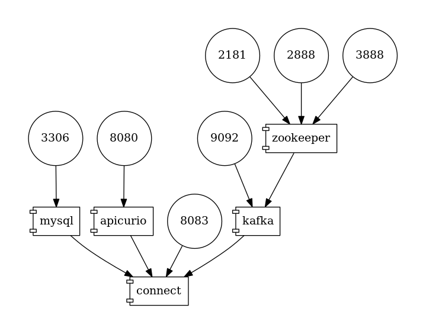

# Debezium with Apicurio Registry

This example demonstrates how to use Debezium with [Apicurio Registry](https://github.com/Apicurio/apicurio-registry) for schema management.

Apicurio Registry provides:
* its own native Avro converter and Protobuf serializer
* a JSON converter that exports its schema into the registry
* a compatibility layer with other schema registries such as IBM's or Confluent's

For the Apicurio examples we will use the following deployment topology:



## Prerequisites

- Docker and Docker Compose installed
- Ports 3306, 8080, 8083, 9092, 9093 available

## Start the environment
```shell
export DEBEZIUM_VERSION=2.7
docker-compose up
```

This starts Kafka (KRaft mode), MySQL with the sample `inventory` database, Apicurio Registry on port 8080, and Debezium Connect with Apicurio converters enabled.

---

## JSON format

Configuring JSON converter with externalized schema at the Debezium Connector involves specifying the converter and schema registry as a part of the connectors configuration.
```shell
# Start MySQL connector with Apicurio JSON converter
curl -i -X POST -H "Accept:application/json" -H "Content-Type:application/json" \
  http://localhost:8083/connectors/ -d @register-mysql-apicurio-converter-json.json
```

You can access the first version of the schema for `customers` values like so:
```shell
curl -X GET http://localhost:8080/apis/registry/v2/groups/default/artifacts/dbserver1.inventory.customers-value
```

Or, if you have the `jq` utility installed, you can get a formatted output like this:
```shell
curl -X GET http://localhost:8080/apis/registry/v2/groups/default/artifacts/dbserver1.inventory.customers-value | jq .
```

If you alter the structure of the `customers` table in the database and trigger another change event, a new version of that schema will be available in the registry.

You can consume the JSON messages in the same way as with standard JSON converter:
```shell
docker-compose exec kafka /kafka/bin/kafka-console-consumer.sh \
    --bootstrap-server kafka:9092 \
    --from-beginning \
    --property print.key=true \
    --topic dbserver1.inventory.customers
```

When you look at the data message you will notice that it contains only `payload` but not `schema` part as this is externalized into the registry.

---

## Avro format using Apicurio Avro converter
```shell
# Start MySQL connector with Apicurio native Avro converter
curl -i -X POST -H "Accept:application/json" -H "Content-Type:application/json" \
  http://localhost:8083/connectors/ -d @register-mysql-apicurio-converter-avro.json
```

You can access the first version of the schema for `customers` values like so:
```shell
curl -X GET http://localhost:8080/apis/registry/v2/groups/default/artifacts/dbserver1.inventory.customers-value
```

Or, if you have the `jq` utility installed, you can get a formatted output like this:
```shell
curl -X GET http://localhost:8080/apis/registry/v2/groups/default/artifacts/dbserver1.inventory.customers-value | jq .
```

---

## Avro format using Apicurio Avro converter in compatibility mode
```shell
# Start MySQL connector with Apicurio Avro converter in Confluent-compatible mode
curl -i -X POST -H "Accept:application/json" -H "Content-Type:application/json" \
  http://localhost:8083/connectors/ -d @register-mysql-apicurio-compatibile-converter-avro.json
```

You can access the first version of the schema for `customers` values like so:
```shell
curl -X GET http://localhost:8080/apis/registry/v2/groups/default/artifacts/dbserver1.inventory.customers-value | jq .
```

To consume the Avro messages it is possible to use `kafkacat` tool:
```shell
docker run --rm --tty \
  --network apicurio_default \
  quay.io/debezium/tooling:1.2 \
  kafkacat -b kafka:9092 -C -o beginning -q -s value=avro -r http://apicurio:8080/apis/ccompat/v6 \
  -t dbserver1.inventory.customers | jq .
```

---

## Avro format using Confluent Avro converter
```shell
# Start MySQL connector using Confluent AvroConverter pointed at Apicurio's compatibility API
curl -i -X POST -H "Accept:application/json" -H "Content-Type:application/json" \
  http://localhost:8083/connectors/ -d @register-mysql-apicurio.json
```

You can access the first version of the schema for `customers` values like so:
```shell
curl -X GET http://localhost:8080/apis/ccompat/v6/subjects/dbserver1.inventory.customers-value/versions/1
```

Or, if you have the `jq` utility installed, you can get a formatted output like this:
```shell
curl -X GET http://localhost:8080/apis/ccompat/v6/subjects/dbserver1.inventory.customers-value/versions/1 | jq '.schema | fromjson'
```

To consume the Avro messages it is possible to use `kafkacat` tool:
```shell
docker run --rm --tty \
  --network apicurio_default \
  quay.io/debezium/tooling:1.2 \
  kafkacat -b kafka:9092 -C -o beginning -q -s value=avro -r http://apicurio:8080/apis/ccompat/v6 \
  -t dbserver1.inventory.customers | jq .
```

---

## Stop the environment
```shell
docker-compose down
```

To also remove volumes:
```shell
docker-compose down -v
```
