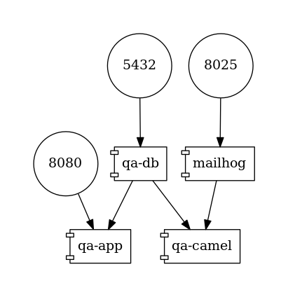

# Apache Camel Component for Debezium

The integration framework [Apache Camel](https://camel.apache.org/) provides a set of components integrating Debezium ([Postgres](https://camel.apache.org/components/latest/debezium-postgres-component.html) and other connectors) with Apache Camel.
This example demonstrates a sample application (A Q&A site, inspired by StackOverflow) and an integration pipeline capturing changes in the database generated by the application.

## Topology

The example consists of multiple components:

* application accepting REST calls representing questions and answers to the questions
* PostgreSQL database to which the application writes the questions and answers
* MailHog test SMTP server
* Apache Camel pipeline that
  * captures database changes
  * converts the raw changes into domain Java classes
  * creates an aggregate object from answers and associated question using Infinispan-based message store
  * sends an email to author for every question created
  * sends an email to the author of the question and author of the answer for every answer created
  * when a question has three answers a message is sent to a Twitter timeline



## How to run

Build the application and the pipeline and start PostgreSQL instance and MailHog server by running:

```
# Terminal One
$ mvn clean install
```

Start the deloyment (you need a Twitter developer account)
```
$ env TWITTER_CONSUMER_KEY=<...> TWITTER_CONSUMER_SECRET=<...> TWITTER_ACCESS_TOKEN=<...> TWITTER_ACCESS_TOKEN_SECRET=<...> docker-compose up
```

Create a question and three answers to it
```
# Terminal Two
$ curl -v -X POST -H 'Content-Type: application/json' http://0.0.0.0:8080/question/ -d @src/test/resources/messages/create-question.json
$ curl -v -X POST -H 'Content-Type: application/json' http://0.0.0.0:8080/question/1/answer -d @src/test/resources/messages/create-answer1.json
$ curl -v -X POST -H 'Content-Type: application/json' http://0.0.0.0:8080/question/1/answer -d @src/test/resources/messages/create-answer2.json
$ curl -v -X POST -H 'Content-Type: application/json' http://0.0.0.0:8080/question/1/answer -d @src/test/resources/messages/create-answer3.json
```

Check the emails sent in MailHog UI (http://localhost:8025/) in browser - four emails should be visible and your Twitter account should containe a message like `Question 'How many legs does a dog have?' has many answers (...)`.
