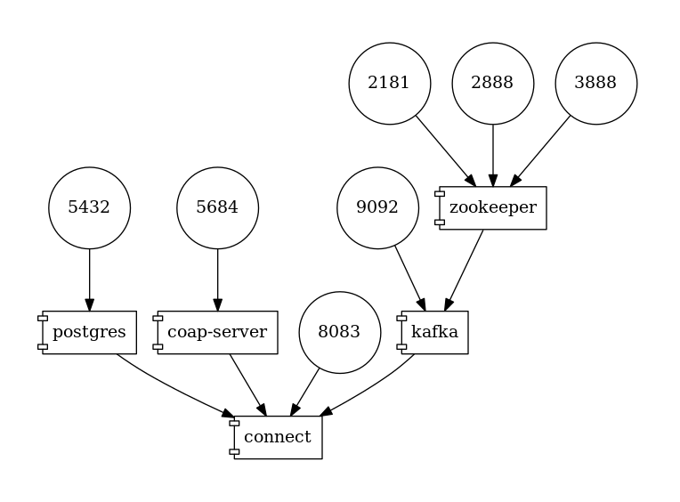

# Camel Connector for Kafka Connect

The integration framework [Apache Camel](https://camel.apache.org/) provides a large set of components that provides a declarative interface to communicate with disparate systems using a large set of protocols.

[Camel Kafka Connector](https://github.com/apache/camel-kafka-connector) is an integration layer between Camel components and the Kafka Connect framework.
This enables the developer to use Camel producers and consumers as a source or sink connector for Kafka Connect.

This example demonstrates a simple IoT integration scenario where Debezium listens on a database table and forwards captured changes into an IoT device using [CoAP protocol](https://tools.ietf.org/html/rfc7252).

## Topology

The example consists of multiple components:

* PostgreSQL database that acts as a source of change events
* CoAP server that prints received requests into the console
* Kafka Connect deployment consisting of
  * Apache Zookeeper
  * Apache Kafka broker
  * Kafka Connect instance with the Debezium and Camel connectors



## How to run

Build the CoAP server and start the example by running:

```
$ export DEBEZIUM_VERSION=1.4
$ mvn clean install
$ docker-compose up --build
```

Deploy the Camel Kafka Connector:

```
$ curl -i -X POST -H "Accept:application/json" -H  "Content-Type:application/json" http://localhost:8083/connectors/ -d @sink.json
```

Deploy the Debezium PostgreSQL Connector:

```
$ curl -i -X POST -H "Accept:application/json" -H  "Content-Type:application/json" http://localhost:8083/connectors/ -d @source.json
```

The CoAP server terminal should contain multiple messages like this:

```
coap-server_1  | 2020-02-24 10:39:41,276 INFO   ||  CoAP server has received message ',"optional":false,"name":"dbserver1.inventory.customers.Envelope"},"payload":{"before":null,"after":{"id":1001,"first_name":"Sally","last_name":"Thomas","email":"sally.thomas@acme.com"},"source":{"version":"1.0.0.Final","connector":"postgresql","name":"dbserver1","ts_ms":1582540780807,"snapshot":"true","db":"postgres","schema":"inventory","table":"customers","txId":596,"lsn":33816576,"xmin":null},"op":"r","ts_ms":1582540780809}}' with headers {Content-Type=application/octet-stream}   [route1]
coap-server_1  | 2020-02-24 10:39:41,292 INFO   ||  CoAP server has received message ',"optional":false,"name":"dbserver1.inventory.customers.Envelope"},"payload":{"before":null,"after":{"id":1002,"first_name":"George","last_name":"Bailey","email":"gbailey@foobar.com"},"source":{"version":"1.0.0.Final","connector":"postgresql","name":"dbserver1","ts_ms":1582540780810,"snapshot":"true","db":"postgres","schema":"inventory","table":"customers","txId":596,"lsn":33816576,"xmin":null},"op":"r","ts_ms":1582540780810}}' with headers {Content-Type=application/octet-stream}   [route1]
coap-server_1  | 2020-02-24 10:39:41,297 INFO   ||  CoAP server has received message ',"optional":false,"name":"dbserver1.inventory.customers.Envelope"},"payload":{"before":null,"after":{"id":1003,"first_name":"Edward","last_name":"Walker","email":"ed@walker.com"},"source":{"version":"1.0.0.Final","connector":"postgresql","name":"dbserver1","ts_ms":1582540780812,"snapshot":"true","db":"postgres","schema":"inventory","table":"customers","txId":596,"lsn":33816576,"xmin":null},"op":"r","ts_ms":1582540780812}}' with headers {Content-Type=application/octet-stream}   [route1]
coap-server_1  | 2020-02-24 10:39:41,302 INFO   ||  CoAP server has received message ',"optional":false,"name":"dbserver1.inventory.customers.Envelope"},"payload":{"before":null,"after":{"id":1004,"first_name":"Anne","last_name":"Kretchmar","email":"annek@noanswer.org"},"source":{"version":"1.0.0.Final","connector":"postgresql","name":"dbserver1","ts_ms":1582540780812,"snapshot":"true","db":"postgres","schema":"inventory","table":"customers","txId":596,"lsn":33816576,"xmin":null},"op":"r","ts_ms":1582540780812}}' with headers {Content-Type=application/octet-stream}   [route1]
```

End the application:

```
# Shut down the cluster
docker-compose down
```
