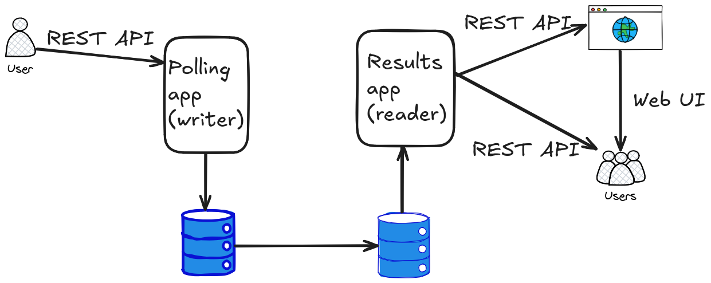
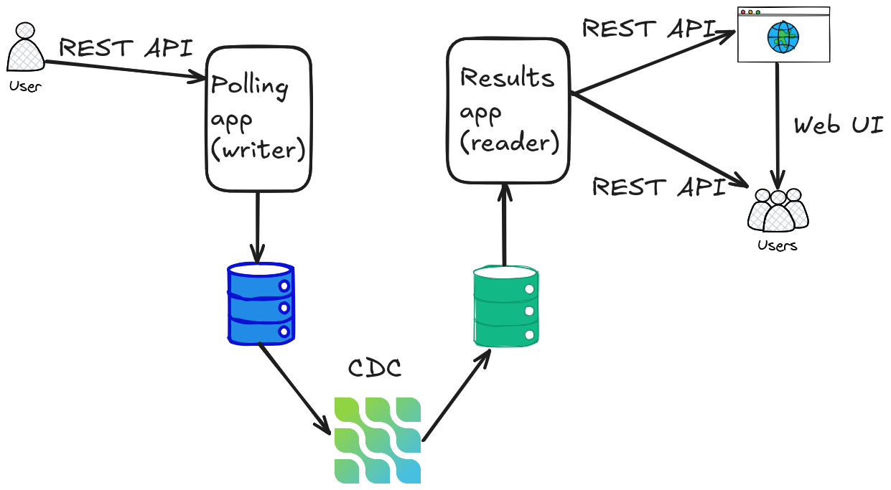
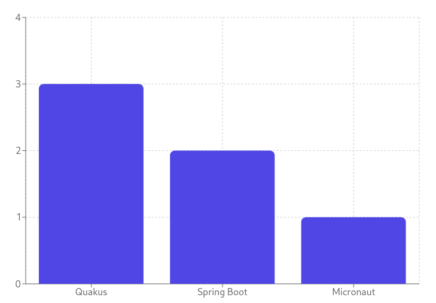
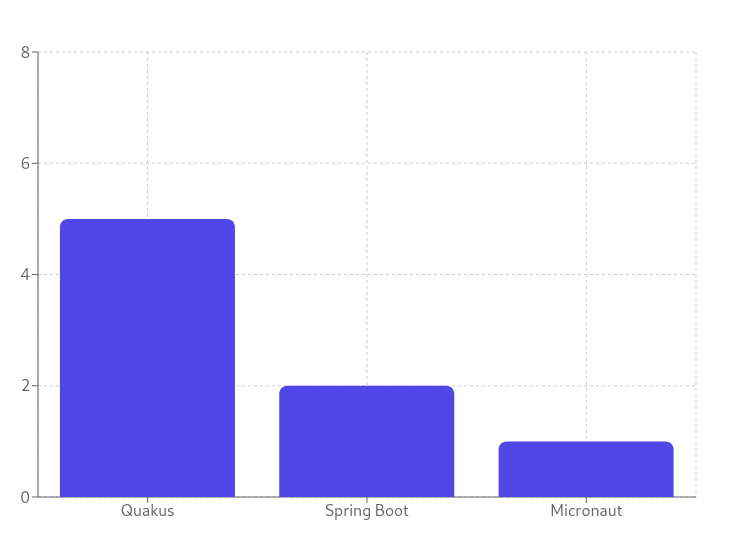

= CQRS Design Pattern

Command Query Responsibility Segregation (CQRS) pattern is a design pattern used mostly in microservice architecture to separate read and write operations from/to the database.
It can be also used for aggregating data from multiple data sources into one centralized data source.

In this demo we use a single source database, which is used by one microservice to store the data.
Then the data is streamed to another database instance which serves the second microservice for reading the data and serving them to the user via web UI.

== Use case

The demo implements very simple voting application.
It comprises two microservices, backend databases, one for each of the microservices, and eventually Kafka Connect with Debezium connector and appropriate sink connector for streaming the data between these two applications.
The first microservice allows the user to create a poll with several options and cast a vote for option of the user preference via REST API.
The second microservice show current results of the poll - either via REST API or via web UI.
Both microservices, including web UI, are implemented using link:https://quarkus.io/[Quarkus framework].

== Deployment architectures

The demo shows several ways how to implement this pattern.
As the source database is always used PostgreSQL database.
In the first possible implementation we can take advantage of PostgreSQL link:https://www.postgresql.org/docs/current/runtime-config-replication.html[stremaing replication] capabilities and setup replication between two PostgreSQL instances.
In this setup there is no need to use any other component and the schema of our deployment looks like this:



If we need to aggregate data from various data sources and/or want to use different type of the database for the data aggregation, we need setup streaming of the data from the source database to the destination database.
The most easy and at the same time also the most robust solution is to use change data capture and Debezium.
The deployment model will be more complicated, but we get much more flexibility with this design:




In this demo we will cover three situations:

* streaming data from PostgreSQL to PostgreSQL using its streaming replication capabilities
* streaming data from PostgreSQL to another SQL database, in our case MySQL database
* streaming data from PostgreSQL to a special purpose database, in our case into link:https://questdb.com/[QuestDB], a high-performance time series database 


== Building the demo

First we need to build our two microservices.
The first microservice which creates polls and registers the votes needs to be build only once:

```
mvn clean package -f poll-service/pom.xml
```

As we will change the database of the second microservice during the demo, it needs different connection parameters and also SQL query can be different for different databases.
All these parameters are stores in corresponding application properties files.
Actual properties file is selected by Quarkus based on the Quarkus profile used during compilation.
For running the demo with PostgreSQL replication, use `postgres` profile and run:

```
mvn clean package -Dquarkus.profile=postgres -f poll-results-service/pom.xml
```

If you would like to run the demo with Mysql or QuestDB, you have to rebuild this application with `-Dquarkus.profile=mysql` or `-Dquarkus.profile=questdb` respectively.
The first microservice doesn't have to be rebuild.
This shows another neat property of CQRS design pattern - respective microservices can be evolved and updated completely independently.

== Running the demo

The demo can be run using Docker Compose by selecting Debezium version and the compose file of your choice.
For PostgreSQL run:

```
export DEBEZIUM_VERSION=3.3
docker compose -f docker-compose-postgres.yaml up --build
```
To run the demo with Mysql or QuestDB, just change the compose file to `docker-compose-mysql.yaml` or `docker-compose-questdb.yaml` respectively, as we will show later on.
During the startup you may see some Hibernate or JDBC errors.
The reason is that our database is empty and some queries may fail.

So let's create some poll now.
Send a `POST` request to REST API of the first microservice with JSON data containing the poll question and options which users can vote for:

```
curl -v  -H "Content-Type: application/json" -H "Accept: application/json" -d '{"question": "Which Java framework is better?", "options": [{"pollOption":"Spring Boot"}, {"pollOption":"Quakus"}, {"pollOption":"Micronaut"}]}' http://localhost:8080/poll
```

You can check if the poll was created by sending `GET` request to the same microservice:

```
curl -H "Accept: application/json" http://localhost:8080/poll
```

and you should get something like this:

```
[{"id":1,"question":"Which Java framework is better?","created":"2025-10-07T16:44:27.030+00:00","options":[{"id":1,"pollOption":"Spring Boot"},{"id":2,"pollOption":"Quakus"},{"id":3,"pollOption":"Micronaut"}],"votes":[]}]
```

As you can see, there are no votes yet, so let vote for some options, again using REST API:

```
curl -v -X POST -H "Content-Type: application/json" -H "Accept: application/json" http://localhost:8080/poll/1/vote/1
curl -v -X POST -H "Content-Type: application/json" -H "Accept: application/json" http://localhost:8080/poll/1/vote/1
curl -v -X POST -H "Content-Type: application/json" -H "Accept: application/json" http://localhost:8080/poll/1/vote/2
curl -v -X POST -H "Content-Type: application/json" -H "Accept: application/json" http://localhost:8080/poll/1/vote/2
curl -v -X POST -H "Content-Type: application/json" -H "Accept: application/json" http://localhost:8080/poll/1/vote/2
curl -v -X POST -H "Content-Type: application/json" -H "Accept: application/json" http://localhost:8080/poll/1/vote/3
```

Now, repeating the previous `GET` request on the poll service, we get the list of votes:

```
curl -H "Accept: application/json" http://localhost:8080/poll
{"id":1,"question":"Which Java framework is better?","created":"2025-10-07T16:44:27.030+00:00","options":[{"id":1,"pollOption":"Spring Boot"},{"id":2,"pollOption":"Quakus"},{"id":3,"pollOption":"Micronaut"}],"votes":[{"id":1,"pollId":1,"votedOption":1,"votedOn":"2025-10-07T16:47:30.446+00:00"},{"id":2,"pollId":1,"votedOption":2,"votedOn":"2025-10-07T16:47:35.378+00:00"},{"id":3,"pollId":1,"votedOption":2,"votedOn":"2025-10-07T16:47:36.321+00:00"},{"id":4,"pollId":1,"votedOption":2,"votedOn":"2025-10-07T16:47:37.191+00:00"},{"id":5,"pollId":1,"votedOption":3,"votedOn":"2025-10-07T16:47:40.202+00:00"},{"id":6,"pollId":1,"votedOption":1,"votedOn":"2025-10-07T16:48:50.951+00:00"}]}
```

However, we are interested in the results.
To get them, we need to query results microservice.
We can do so also by using REST API:

```
curl -H "Accept: application/json" http://localhost:8081/results/1
```

resulting into

```
[{"option":"Quakus","votes":3},{"option":"Spring Boot","votes":2},{"option":"Micronaut","votes":1}]
```

We can also use more user friendly web UI, which under the hood uses REST API as well.
In the browser navigate to http://localhost:8081/ and you should see graph like this one:



The web UI uses ReactJS and queries REST backend for updated results periodically.
Therefore if you cast more votes:

```
curl -v -X POST -H "Content-Type: application/json" -H "Accept: application/json" http://localhost:8080/poll/1/vote/2
curl -v -X POST -H "Content-Type: application/json" -H "Accept: application/json" http://localhost:8080/poll/1/vote/2
```

you should see the results are being updated automatically in a few seconds:



Once you are done, shut down the Docker compose:

```
docker compose -f docker-compose-postgres.yaml down
```

== Using MySQL database

Now we can try with MySQL database as a database backend for the results microservice.

As mentioned above, we need to rebuild results microservice with another Quarkus profile to use appropriate JDCB driver and connection parameters:

```
mvn clean package -Dquarkus.profile=mysql -f poll-results-service/pom.xml
```

Once done, we can start MySQL compose file:

```
docker compose -f docker-compose-mysql.yaml up --build
```

As we use different database now, we cannot leverage mechanism for data replication provided by the poll database (assuming that database of you choice even provides it).
This task can be easily solved by Debezium.
Compose files for MySQL and QuestDB already contains Kafka Connect images with required plugins jar files, but we need to start them.
First start Debezium source connector for PostgreSQL:

```
curl -i -X POST -H "Accept:application/json" -H  "Content-Type:application/json" http://localhost:8083/connectors/ -d @postgres-source.json
```

and then start Debezium JDBC sink connector for MySQL:

```
curl -i -X POST -H "Accept:application/json" -H  "Content-Type:application/json" http://localhost:8083/connectors/ -d @mysql-sink.json 
```

As the Docker compose doesn't contain any persistent volumes, you also need to recreate poll survey and votes.
Once done, you should see exactly same results and UI and in the first example.

Before proceeding further, don't forget to shut down MySQL compose:

```
docker compose -f docker-compose-mysql.yaml down
```

== Using QuestDB database

For QuestDb we need to take very similar steps as in MySQL case.
We need to rebuilt the results microservice with corresponding Quarkus profile:

```
mvn clean package -Dquarkus.profile=questdb -f poll-results-service/pom.xml
```

and start QuestDB compose:

```
docker compose -f docker-compose-questdb.yaml up --build
```

Start again PostgreSQL source connector:

```
curl -i -X POST -H "Accept:application/json" -H  "Content-Type:application/json" http://localhost:8083/connectors/ -d @postgres-source.json
```


For the sink side, we cannot use Debezium JDBC sink now, but fortunately  QuestDB provides link:https://questdb.com/docs/third-party-tools/kafka/[dedicated sink connector] for QuestDB.
Even better, QuestDB sink connector understands Debezium records, so we don't have to modify the records any further.
As we are interested only in new state in the database and don't need any metadata or previous state, we will add  link:https://debezium.io/documentation//reference/transformations/event-flattening.html[Extract new record state SMT] into the sink configuration.
This will reduce the amount of data loaded into QuestDB, while still keeping all the metadata and previous record state in the Kafka for other possible consumers.
QuestDB sink is started in the very same way as other connectors:

```
curl -i -X POST -H "Accept:application/json" -H  "Content-Type:application/json" http://localhost:8083/connectors/ -d @questdb-sink.json
```

And again, we need to re-create the poll and votes in PostgreSQL database. 
After that you should be able to see updated results in the web UI.

Finally, shut the QuestDB compose down:

```
docker compose -f docker-compose-questdb.yaml down
```
