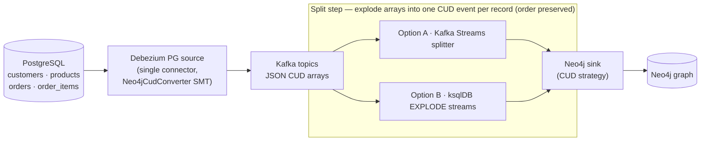

# Debezium Neo4j (Relational → Graph)

This example streams a relational **PostgreSQL** e-commerce schema into a **Neo4j** property
graph using Change Data Capture. 
It combines three steps:

1. **Debezium** captures row changes from PostgreSQL.
2. The **`Neo4jCudConverter` SMT** converts each change event into
   [Neo4j CUD format](https://neo4j.com/docs/kafka/current/sink/cud/)
3. A **split step** (Kafka Streams *or* ksqlDB) explodes the SMT's JSON arrays into one CUD
   event per record, which the **official Neo4j Kafka sink connector** applies to Neo4j.

The relational schema maps to this graph:

```
(:Customer)                                    <- customers table
(:Product)                                     <- products table
(:Order)-[:PLACED_BY]->(:Customer)             <- orders table (customer_id FK)
(:Order)-[:CONTAINS {quantity}]->(:Product)    <- order_items join table
```

## Contents

* [Architecture](#architecture)
* [Why a split step is needed](#why-a-split-step-is-needed)
* [Prerequisites](#prerequisites)
* [Option A — Kafka Streams split (default)](#option-a--kafka-streams-split-default)
* [Option B — ksqlDB split](#option-b--ksqldb-split)
* [Exploring the graph](#exploring-the-graph)
* [How it works](#how-it-works)
* [Cleanup](#cleanup)

## Architecture




## Why a split step is needed

With the default `output.mode=array`, the SMT packs a change event's node **and** its
relationships into a **single JSON array per Kafka record** so node events are always ordered
before their relationship events. The Neo4j sink expects **one CUD event per record**, so an
external step must explode each array while preserving order. This example demonstrates the two
recommended approaches.

## Prerequisites

* Docker and Docker Compose
* Ports free on localhost: `8083` (Connect), `7474`/`7687` (Neo4j), `5432` (Postgres),
  `9092` (Kafka), and for Option B `8088` (ksqlDB)

All commands below run from this directory and inherit `DEBEZIUM_VERSION` from the repository's
root [`.env`](../.env).

## Option A — Kafka Streams split (default)

A small Kafka Streams application ([`splitter/`](./splitter)) reads each array topic,
`flatMapValues` explodes it, and writes one CUD event per record to the `neo4j.*` topics. 

Start everything (the `--build` adds the Neo4j sink connector to the Connect image and compiles
the splitter):

```shell
docker-compose --env-file ../.env -f docker-compose-kstreams.yaml up --build
```

In a second terminal, register the source connector and the Neo4j sink:

```shell
curl -i -X POST -H "Accept:application/json" -H "Content-Type:application/json" \
  http://localhost:8083/connectors/ -d @register-postgres-source.json
curl -i -X POST -H "Accept:application/json" -H "Content-Type:application/json" \
  http://localhost:8083/connectors/ -d @register-neo4j-sink.json
```

Jump to [Exploring the graph](#exploring-the-graph).

## Option B — ksqlDB split

Instead of a custom application, [ksqlDB](https://ksqldb.io/)'s `EXPLODE` function splits the
arrays (see [`docker-compose-ksqldb.yaml`](./docker-compose-ksqldb.yaml)).

Start the ksqlDB topology:

```shell
docker-compose --env-file ../.env -f docker-compose-ksqldb.yaml up --build
```

Register the same source and sink connectors:

```shell
curl -i -X POST -H "Accept:application/json" -H "Content-Type:application/json" \
  http://localhost:8083/connectors/ -d @register-postgres-source.json
curl -i -X POST -H "Accept:application/json" -H "Content-Type:application/json" \
  http://localhost:8083/connectors/ -d @register-neo4j-sink.json
```

The `ksqldb-init` service applies [`ksqldb-split.sql`](./ksqldb-split.sql) automatically once the
source topics exist, creating the split streams with no manual step. When it logs
`ksqldb-init: split streams created.`, continue to [Exploring the graph](#exploring-the-graph).

## Exploring the graph

Open the Neo4j Browser at <http://localhost:7474> (user `neo4j`, password `password`) and run:

```cypher
MATCH (o:Order)-[:PLACED_BY]->(c:Customer) RETURN o, c LIMIT 25;
MATCH (o:Order)-[r:CONTAINS]->(p:Product) RETURN o, r, p LIMIT 25;
```

Or query from the shell:

```shell
docker-compose --env-file ../.env -f docker-compose-kstreams.yaml exec neo4j \
  cypher-shell -u neo4j -p password "MATCH (c:Customer) RETURN c.id, c.email ORDER BY c.id;"
```

Make a change in Postgres and watch it flow into the graph:

```shell
docker-compose --env-file ../.env -f docker-compose-kstreams.yaml exec postgres \
  psql -U postgres -d postgres -c \
  "INSERT INTO orders (id, customer_id, total, status) VALUES (5003, 1001, 12.50, 'pending');"
```

## How it works

* **SMT array output & split.** The SMT runs in the default `output.mode=array`. Each
  Debezium change event becomes a JSON array of CUD events; the split step turns that into one
  CUD event per record. See the [SMT documentation](https://github.com/debezium/debezium/blob/main/documentation/modules/ROOT/pages/transformations/neo4j-cud-converter.adoc).
* **Single connector, per-table SMT mapping** (in `register-postgres-source.json`): one Debezium
  source connector captures all four tables, and one `Neo4jCudConverter` transform maps each table
  via a `table.<name>.*` namespace. The SMT reads `source.table` from every change event and
  dispatches to the matching mapping (tables without a mapping pass through unchanged):
  * `table.customers.*`, `table.products.*` → plain nodes (`node.labels`, `node.id.properties`).
  * `table.orders.*` → an `Order` node plus a `PLACED_BY` relationship to `Customer`
    (`relationship.customer_id.*`). The `customer_id` column is automatically excluded from node
    properties.
  * `table.order_items.*` → `node.mode=relationship`; the join table becomes a `CONTAINS`
    relationship between `Order` and `Product`, with `quantity` as a relationship property.
* **`target.node.op=merge`.** Relationship endpoints are configured to *merge* (create if
  missing) rather than the default *match*, so the demo is robust to cross-topic ordering. In a
  stricter pipeline you may prefer `match` so relationships only attach to already-ingested nodes.
* **`decimal.handling.mode=double`.** The source connector sets this because the SMT cannot map
  `VariableScaleDecimal` values (`orders.total`, `products.price`). Use `string` instead if you
  need exact precision. See the SMT docs' *Decimal handling* section.
* **Converters.** The SMT emits its JSON array as a string, so the source connector uses the
  `StringConverter` for values; the Neo4j sink reads the CUD JSON with the `JsonConverter`.
* **Replica identity.** [`ecommerce.sql`](./ecommerce.sql) sets `REPLICA IDENTITY FULL` so
  DELETE events carry the key columns the SMT needs to build the CUD `ids` for delete operations.

## Cleanup

```shell
# Option A
docker-compose --env-file ../.env -f docker-compose-kstreams.yaml down -v
# Option B
docker-compose --env-file ../.env -f docker-compose-ksqldb.yaml down -v
```
