Using Debezium Platform to manage and stream changes
===
This example  will walk you through how to use the Debezium Management Platform to manage and stream changes from a PostgreSQL database into Apache Kafka.


Preparing the Environment
---
As the first step we will provision a local Kubernetes cluster using [minikube](https://minikube.sigs.k8s.io/docs/) and will install an ingress controller. For this example, considering a local set up, we will use the `/etc/hosts` to resolve the domain.
The following script, when executed, will use minikube to provision a local k8s cluster named `debezium` and will add the required ingress controllers. It will also update the `/etc/hosts` to add the domain url.

```sh
./create-environment.sh
```
> **_NOTE:_**
If you are using minikube on Mac, you need also to run the `minikube tunnel -p debezium` command. For more details see [this](https://minikube.sigs.k8s.io/docs/drivers/docker/#known-issues) and [this](https://stackoverflow.com/questions/70961901/ingress-with-minikube-working-differently-on-mac-vs-ubuntu-when-to-set-etc-host).

Now that you have the required k8s environment setup, its time to fire the required infra for this example. As we will be using PostgreSQL database and the Apache Kafka broker as source and the destination for our pipeline. The following script will create a dedicated namespace `debezium-platform` and use it going forward for further installations of our example. It will also provision the PostgreSQL database and the Apache Kafka broker.

```shell
./setup-infra.sh
```

you can check the required infra is up and running

```shell

$ kubectl get pods

NAME                                        READY   STATUS    RESTARTS   AGE
dbz-kafka-dual-role-0                       1/1     Running   0          98s
dbz-kafka-entity-operator-9f4d8fbc4-twq7j   1/2     Running   0          14s
postgresql-85cc668d48-pjn58                 1/1     Running   0          4m2s
strimzi-cluster-operator-7dc6fbcbf5-h28dl   1/1     Running   0          3m59s

```

Deploying Debezium Management Platform
---
We will install debezium-platform platform through helm 

```shell
helm repo add debezium https://charts.debezium.io &&
helm install debezium-platform debezium/debezium-platform --version 3.7.0 --set database.enabled=true --set domain.url=platform.debezium.io

```

- `domain.url` is the only required property; it is used as host in the Ingress definition. 
- `database.enabled` property is used. This property helps to simplify deployment in testing environments by automatically deploying the PostgreSQL database that is required by the conductor service. When deploying in a production environment, do not enable automatic deployment of the PostgreSQL database. Instead, specify an existing database instance, by setting the database.name, database.host, and other properties required to connect to the database. 

```shell

$ kubectl get pods

NAME                                         READY   STATUS    RESTARTS       AGE
conductor-7c48c54c5c-rmjw9                   1/1     Running   0              4m24s
dbz-kafka-dual-role-0                        1/1     Running   0              6m7s
dbz-kafka-entity-operator-54dd7cc446-k8cfh   2/2     Running   0              5m9s
debezium-operator-666f7b44d9-6tf4n           1/1     Running   0              4m24s
postgres-69c4c64ff5-2tfmw                    1/1     Running   0              4m24s
postgresql-85cc668d48-xtlsw                  1/1     Running   0              8m12s
stage-6c64f68df6-cfhjs                       1/1     Running   0              4m24s
strimzi-cluster-operator-7dc6fbcbf5-wkqgz    1/1     Running   0              8m9s

```

After all pods are running you should access the Debezium-platform-stage(UI) from `http://platform.debezium.io/`, now you have completed the installing and running the debezium-platform part.


Using the debezium-platform-stage(UI) for setting up our data pipeline 
---

Now once you have running platform-stage(UI), we will create a data pipeline and all its 
resources i.e connections, source, destination and transform(as per need) through it. You will see different side navigation option to configure them.

For this demo, see the configuration properties you can use for each resource type as 
illustrated below:

### Connection

Open **Connections**, then **Add connection**.

After you enter the values, **validate** the connection. **Create connection** stays disabled until validation succeeds. A successful validation confirms the platform can reach PostgreSQL or Kafka with these settings, before the connection is saved and used by a pipeline.

#### PostgreSQL (source connection)

Filter the catalog by **Source** and select **PostgreSQL**.

| Field | Value |
| --- | --- |
| Name | `postgres-connection` |
| The hostname of the database (hostname) | `postgresql` |
| The port of the database (port) | `5432` |
| Username to connect to the database (username) | `debezium` |
| Password to connect to the database (password) | `debezium` |
| The name of the database (database)| `debezium` |

 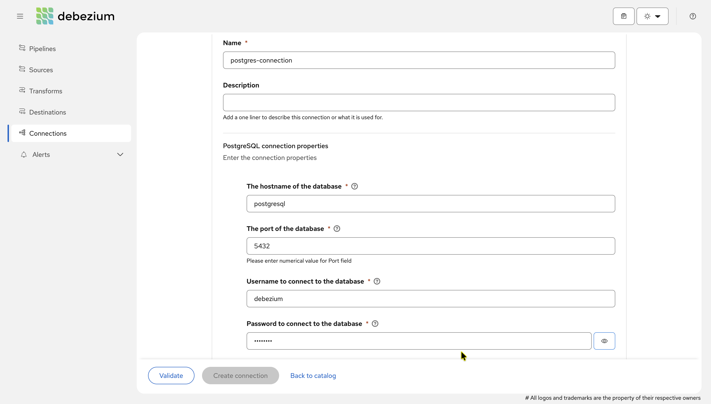

Click **Validate**. When validation succeeds, **Create connection** is enabled. Click it to save the connection.

#### Kafka (destination connection)

Go back to **Add connection**, filter the catalog by **Destination**, and select **Kafka**.

| Field                                                                                                   | Value                                              |
| ---------------------------------------------------------------------------------------------------------| ----------------------------------------------------|
| Name                                                                                                    | `kafka-connection`                                 |
| List of "hostname:port" pairs that address one or more (even all) of the brokers. (`bootstrap.servers`) | `dbz-kafka-kafka-bootstrap.debezium-platform:9092` |

 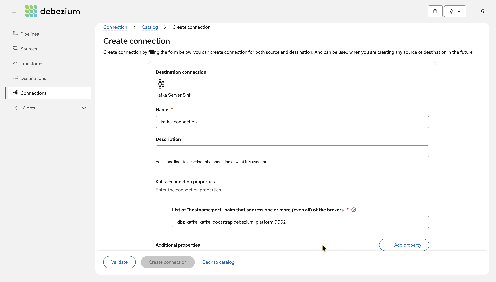

Click **Validate**. When validation succeeds, **Create connection** is enabled. Click it to save the connection.

### Source

Open **Sources** and create a PostgreSQL source. The database host, port, user, password, and database name come from the connection.

**Connection to the Source** lists shows only connections created for PostgreSQL. Select `postgres-connection`.

| Field                    | Value                 |
| --------------------------| -----------------------|
| Source name              | `test-source`         |
| Description              | `PostgreSQL database` |
| Connection to the Source | `postgres-connection` |

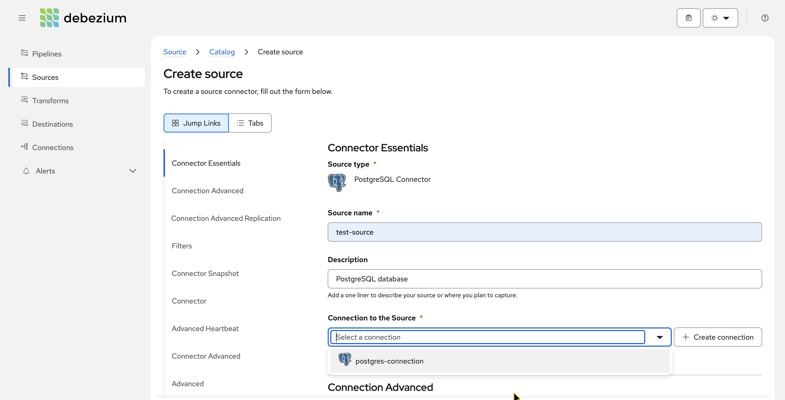

Since **Topic prefix** is required, scroll to **Connector** of the form used side jump link  and set it to `inventory`. Also configure the **Include schemas** field in **Filters** section of the form.

| Field | Value |
| --- | --- |
| Topic prefix (`topic.prefix`) | `inventory` |
| Include schemas (`schema.include.list`) | `inventory` |

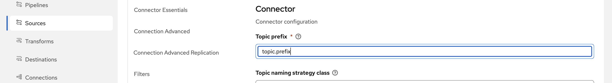

Click **Create source**.

### Destination

Open **Destinations** and create a Kafka destination. Select `kafka-connection`. The bootstrap servers come from that connection.

| Field                         | Value               |
| -------------------------------| ---------------------|
| Destination name              | `test-destination`  |
| Description                   | `Kafka destination` |
| Connection to the Destination | `kafka-connection`  |

Since serializer settings are not listed in the form, we will use **Additional properties** section of the form to add them. Click **Add property** and type the key and the value.. Click **Add property** once for each row:

| Key | Value |
| --- | --- |
| `producer.key.serializer` | `org.apache.kafka.common.serialization.StringSerializer` |
| `producer.value.serializer` | `org.apache.kafka.common.serialization.StringSerializer` |

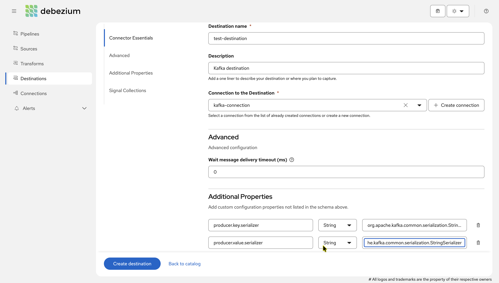

Click **Create destination**.

### Transform

Open **Transforms** and create an Extract New Record State transform. The form does not list the transform options. Add each one as a property key and value.

| Field           | Value                               |
| -----------------| -------------------------------------|
| Transform class | `Debezium Extract New Record State` |
| Transform name  | `Debezium marker`                   |
| Description     | `Extract Debezium payload`          |

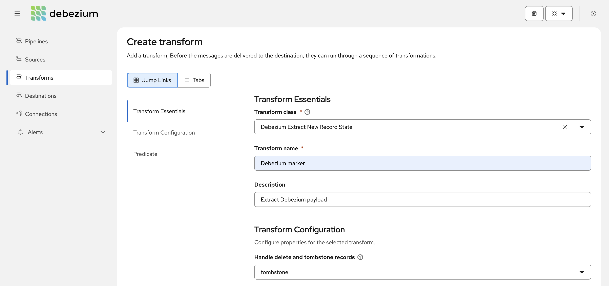

Transform Configuration

| Field                                                                  | Value      |
| ------------------------------------------------------------------------| ------------|
| Adds the specified field(s) to the message if they exist. (add.fields) | `op`       |
| Adds the specified fields to the header if they exist. (add.headers)   | `db,table` |

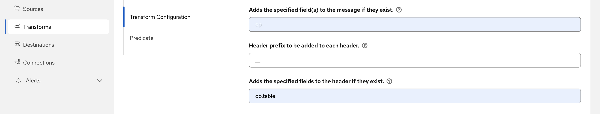

Predicate. Select the predicate type, leave **Negate** unchecked, and add the pattern as a property:

| Field            | Value                          |
| ------------------| --------------------------------|
| Predicate type   | `Kafka Topic Name Matches`     |
| Variant          | `TopicNameMatches`             |
| Pattern          | `inventory.inventory.products` |
| Negate predicate | unchecked                      |

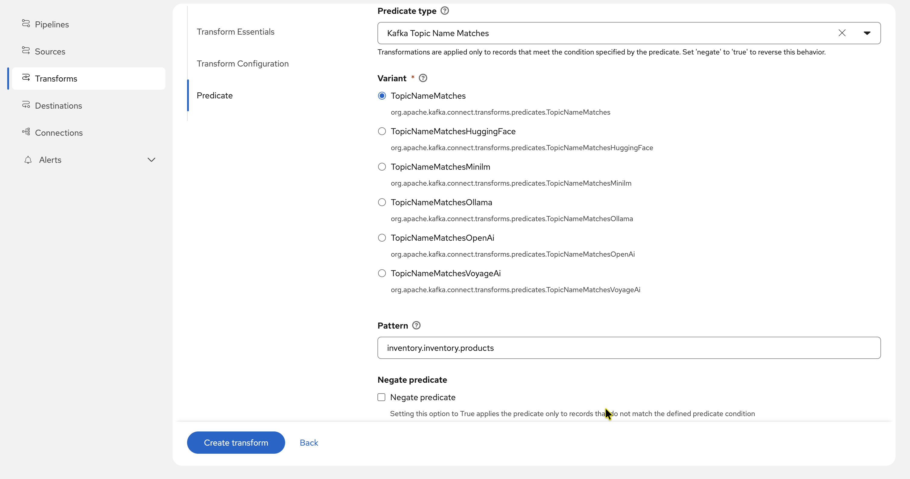

Click **Create transform**.

### Pipeline

Open **Pipelines** and open the pipeline designer.

1. Add the source `test-source`.
2. Add the transform `Debezium marker`.
3. Add the destination `test-destination`.
4. Click **Configure pipeline**.

 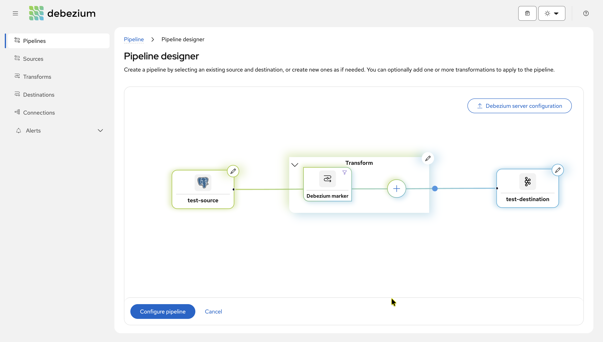

| Field | Value |
| --- | --- |
| Pipeline name | `test-pipeline` |
| Description | `postgresql to kafka data pipeline` |
| Root log level | `DEBUG` |

#### Pipeline configuration
 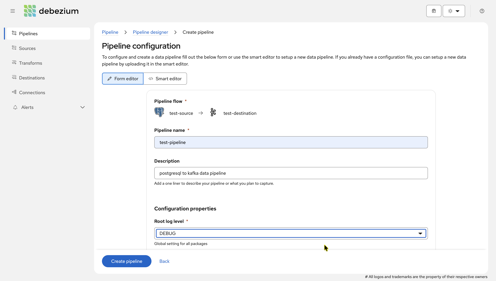

Click **Create pipeline**.

#### Pipeline Running
 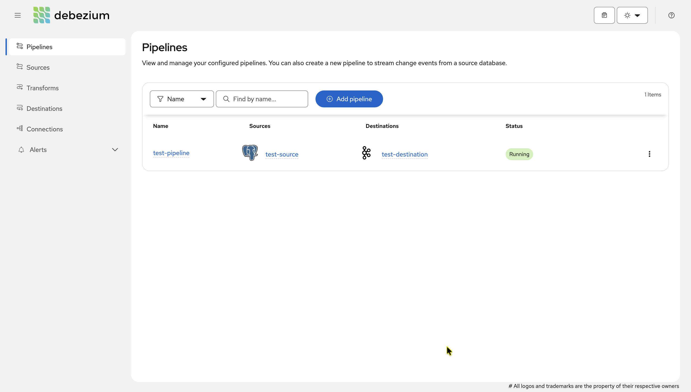
 
After creating the pipeline in the UI its status goes from initial **Deploying** to **Running**. 

Verifying Change Events
---
Once Pipeline is **Running** you can verify that the data pipeline instance `test-pipeline` consumed all initial data from the database with the following command:

```sh

kubectl exec -n debezium-platform -it dbz-kafka-dual-role-0 -- ./bin/kafka-console-consumer.sh --bootstrap-server=localhost:9092 --topic inventory.inventory.products --from-beginning --max-messages 5

```

Cleanup
---
To remove the Kubernetes environment used in this tutorial, execute the cleanup script:

```sh
./clean-up.sh
```