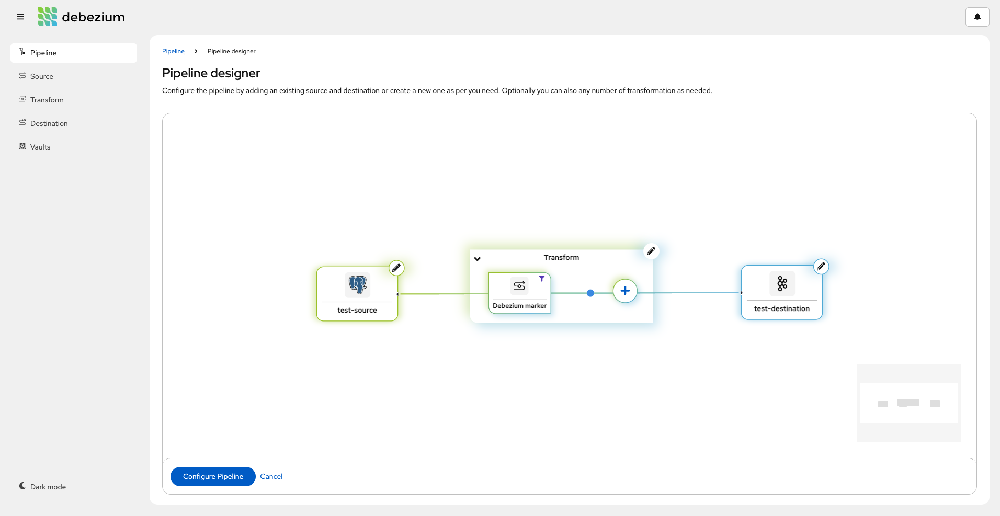

Using Debezium-platfrom to manage and stream changes
===
This example  will walk you through on how to use the Debezium Management Platform to manage and stream changes from a PostgreSQL database into Apache Kafka.


Preparing the Environment
---
As the first step we will provision a local Kubernetes cluster using [minikube](https://minikube.sigs.k8s.io/docs/) and will install an ingress controller. For this example, considering a local setup, we will use the `/etc/hosts` to resolve the domain.
The following script, when executed, will use minikube to provision a local k8s cluster named `debezium` and will add the required ingress controllers. It will also update the `/etc/hosts` to add the domain url.

```sh
./create-environment.sh
```
> **_NOTE:_**
If you are using minikube on Mac, you need also to run the `minikube tunnel -p debezium` command. For more details see [this](https://minikube.sigs.k8s.io/docs/drivers/docker/#known-issues) and [this](https://stackoverflow.com/questions/70961901/ingress-with-minikube-working-differently-on-mac-vs-ubuntu-when-to-set-etc-host).

Now that you have the required k8s environment setup, its time to fire the required infra for this example. As we will be using PostgreSQL database and the Apache Kafka broker as source and the destination for our pipeline. The following script will create a dedicated namespace `debezium-platform` and use it going forward for further installations of our example. It will also provision the PostgreSQL database and the Apache Kafka broker.

```shell
./setup-infra.sh
```

you can check the required infra is up and running

```shell

$ kubectl get pods

NAME                                        READY   STATUS    RESTARTS   AGE
dbz-kafka-dual-role-0                       1/1     Running   0          98s
dbz-kafka-entity-operator-9f4d8fbc4-twq7j   1/2     Running   0          14s
postgresql-85cc668d48-pjn58                 1/1     Running   0          4m2s
strimzi-cluster-operator-7dc6fbcbf5-h28dl   1/1     Running   0          3m59s

```

Deploying Debezium Management Platform
---
We will install debezium-platfrom platform through helm 

```shell
helm repo add debezium https://charts.debezium.io &&
helm install debezium-platform debezium/debezium-platform --version 3.1.0-final --set database.enabled=true --set domain.url=platform.debezium.io

```

- `domain.url` is the only required property; it is used as host in the Ingress definition. 
- `database.enabled` property is used. This property helps to simplify deployment in testing environments by automatically deploying the PostgreSQL database that is required by the conductor service. When deploying in a production environment, do not enable automatic deployment of the PostgreSQL database. Instead, specify an existing database instance, by setting the database.name, database.host, and other properties required to connect to the database. 

```shell

$ kubectl get pods

NAME                                         READY   STATUS    RESTARTS       AGE
conductor-7c48c54c5c-rmjw9                   1/1     Running   0              4m24s
dbz-kafka-dual-role-0                        1/1     Running   0              6m7s
dbz-kafka-entity-operator-54dd7cc446-k8cfh   2/2     Running   0              5m9s
debezium-operator-666f7b44d9-6tf4n           1/1     Running   0              4m24s
postgres-69c4c64ff5-2tfmw                    1/1     Running   0              4m24s
postgresql-85cc668d48-xtlsw                  1/1     Running   0              8m12s
stage-6c64f68df6-cfhjs                       1/1     Running   0              4m24s
strimzi-cluster-operator-7dc6fbcbf5-wkqgz    1/1     Running   0              8m9s

```

After all pods are running you should access the Debezium-platform-stage(UI) from `http://platform.debezium.io/`, now you have completed the installing and running the debezium-platform part.


Using the debezium-platfrom-stage(UI) for setting up our data pipeline 
---
Now once you have running platfrom-stage(UI), we will create a data pipeline and all its resources i.e source, destination and transform(as per need) thru it. You will see different side navigation option to configure them.

For this demo, see the connection properties you can use for each connector type as illustrated below:

### Source
 #### PostgreSQL

 ```shell
  {
  "name": "test-source",
  "description": "postgreSQL database",
  "type": "io.debezium.connector.postgresql.PostgresConnector",
  "schema": "schema123",
  "vaults": [],
  "config": {
    "topic.prefix": "inventory",
    "database.port": 5432,
    "database.user": "debezium",
    "database.dbname": "debezium",
    "database.hostname": "postgresql",
    "database.password": "debezium",
    "schema.include.list": "inventory"
  }
}

 ```


### Destination
 ```shell
 {
  "name": "test-destination",
  "description": "Kafka destination",
  "type": "kafka",
  "schema": "schema123",
  "vaults": [],
  "config": {
    "producer.key.serializer": "org.apache.kafka.common.serialization.StringSerializer",
    "producer.value.serializer": "org.apache.kafka.common.serialization.StringSerializer",
    "producer.bootstrap.servers": "dbz-kafka-kafka-bootstrap.debezium-platform:9092"
  }
}

 ```

 

### Transform

**Transform class**: o.debezium.transforms.ExtractNewRecordState       
**Transform name**: Debezium marker      
**Description**: Extract Debezium payload  
**Adds the specified fields to the header if they exist**: db,table  
**Adds the specified field(s) to the message if they exist.**: op  
**Predicate type**: org.apache.kafka.connect.transforms.predicates.TopicNameMatches    
**Pattern**: inventory.inventory.products

 ```shell
 {
  "config": {
    "add.fields": "op",
    "add.headers": "db,table"
  },
  "description": "Extract Debezium payload",
  "name": "Debezium marker",
  "predicate": {
    "config": {
      "pattern": "inventory.inventory.products"
    },
    "negate": false,
    "type": "org.apache.kafka.connect.transforms.predicates.TopicNameMatches"
  },
  "schema": "string",
  "type": "io.debezium.transforms.ExtractNewRecordState",
  "vaults": []
}

 ```

 

### Pipeline

Now that you have all the required resources setup, we can proceed on creating the final data pipeline. 

#### Pipeline designer
 

#### Pipeline configuration
 

 
After creating the pipeline in the UI you can check the k8 pods and should see the pipeline pods `test-pipeline-*`

 ```shell
$ kubectl get pods
NAME                                         READY   STATUS    RESTARTS       AGE
conductor-7c48c54c5c-rmjw9                   1/1     Running   0              9m51s
dbz-kafka-dual-role-0                        1/1     Running   0              11m
dbz-kafka-entity-operator-54dd7cc446-k8cfh   2/2     Running   0              10m
debezium-operator-666f7b44d9-6tf4n           1/1     Running   0              9m51s
postgres-69c4c64ff5-2tfmw                    1/1     Running   0              9m51s
postgresql-85cc668d48-xtlsw                  1/1     Running   0              13m
stage-6c64f68df6-cfhjs                       1/1     Running   0              9m51s
strimzi-cluster-operator-7dc6fbcbf5-wkqgz    1/1     Running   0              13m
test-pipeline-645bddd8df-86r4g               1/1     Running   0              116s
 ```


Verifying Change Events
---
You can verify that the data pipeline instance `test-pipeline` deployed in the previous section consumed all initial data from the database with the following command:

```sh

kubectl exec -n debezium-platform -it dbz-kafka-dual-role-0 -- ./bin/kafka-console-consumer.sh --bootstrap-server=localhost:9092 --topic inventory.inventory.products --from-beginning --max-messages 5

```

Cleanup
---
To remove the Kubernetes environment used in this tutorial, execute the cleanup script:

```sh
./clean-up.sh
```