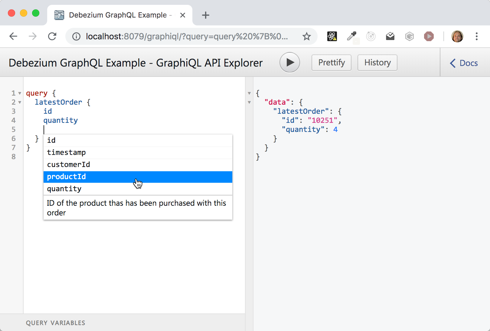

# Debezium - GraphQL Example

This demo shows how to build a GraphQL Subscription on top of Debezium Change Events.

The domain consists of `Order` objects that have among others a quantity field. These objects are stored
in a MySQL database. Debezium captures the changes in the database and publishes new orders to a Kafka Topic.
Using the GraphQL API you can receive the new orders in real-time. The API also allows you to filter events.
For example you might only be interested in Orders with a large quantity (for example for fraud detection) or
for a special product.

There are two applications:

1. The _event-source_, that persists random orders in a MySQL database (simulates 'real' business)

2. The _aggregator_ consumes the messages from the Kafka topics and publishes new orders via a GraphQL API.
   The _aggregator_ is a web app deployed to Thorntail.

## Preparations

Build data generator application and aggregator application:

```shell
mvn clean install -f event-source/pom.xml
mvn clean install -f aggregator/pom.xml
```

Start Kafka, Kafka Connect, MySQL, event source and aggregator:

```shell
export DEBEZIUM_VERSION=1.4
docker-compose up --build
```

Once you see the message "Waiting for source connector to be deployed" in the logs,
deploy the Debezium MySQL connector:

```shell
curl -i -X POST -H "Accept:application/json" -H  "Content-Type:application/json" http://localhost:8083/connectors/ -d @mysql-source.json
```

# Consume messages using GraphiQL

Once you see the message "Thorntail is Ready" in the logs, open the following URL in your browser: http://localhost:8079/graphiql.

It opens [GraphiQL](https://github.com/graphql/graphiql), a GraphQL API Browser.

While writing your GraphQL queries in the editor, you can get code assist using `Ctrl+Space`. Click on the `Docs` tab
on the right side to get the API description.



## Example GraphQL Queries

Return the latest order that has been placed:

```
query { latestOrder { id quantity } }
```

Subscribe to _all_ new orders, return the fields _id_, _productId_, _customerId_ and _quantity_ from the Order:

```
subscription {
  onNewOrder {
    id
    productId
    customerId
    quantity
  }
}
```

Subscribe to new orders that have a _quantity of at least 3_:

```
subscription {
  onNewOrder(withMinQuantity: 3) {
    id
    customerId
    productId
    quantity
  }
}
```

Subscribe to new orders that have a _productId 103_:

```
subscription {
  onNewOrder(withProductId: 103) {
    id
    customerId
    quantity
  }
}
```

Subscribe to new orders that have a a _quantity of at least 2_ and a _productId 103_:

```
subscription {
  onNewOrder(withMinQuantity: 2 withProductId: 103) {
    id
    customerId
    quantity
  }
}
```

_Note:_ The GraphiQL UI might not show all data\_. If responses from the server come too fast, GraphiQL "skips" some of the responses.

# Consume messages using a command-line tool

Included in the examples folder is a simple Java application that runs a GraphQL subscription and displays the incoming data on the console. Other than GraphiQL this tool really shows _all_ messages received from the GraphQL server.

Build the application:

```shell
mvn clean package -f ws-client/pom.xml
```

Run the application (default configuration):

```shell
java -jar ws-client/target/ws-client-jar-with-dependencies.jar
```

The application expects the cluster running as described above, esp. that the GraphQL WebSocket endpoint is available at [ws://localhost:8079/graphql](ws://localhost:8079/graphql). It runs a sample subscription and displays the received responses on the console until you quit the application using `Ctrl+C`.

If you want to the application with another host and/or another GraphQL subscription query, you can pass them via command line args:

```shell
java -jar ws-client/target/ws-client-jar-with-dependencies.jar URI GRAPHQL_SUBSCRIPTION_QUERY
```

For example:

```shell
java -jar ws-client/target/ws-client-jar-with-dependencies.jar ws://localhost:8079/graphql "subscription { onNewOrder { id productId } }"
```

(Please surround the query using double quotes).

# Shut down the cluster

```shell
docker-compose down
```

# Locally testing the aggregator

1. Add `- ADVERTISED_HOST_NAME=<YOUR HOST IP>` to the `environment` section of the "kafka" service in _docker-compose.yaml_.

2. Run all services except the aggregator service:

```shell
docker-compose up --build connect event-source
```

(or run all services as described and then `docker-compose down aggregator`)

3. Run the aggregator from you IDE by running the class `org.wildfly.swarm.Swarm` from the `aggregator` project.
   Set the env variables `KAFKA_SERVICE_HOST` to <YOUR HOST IP> and `KAFKA_SERVICE_PORT` to `9092`
