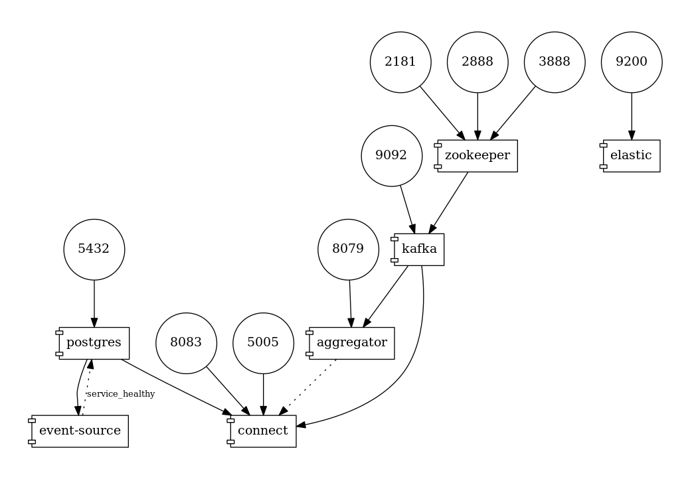

# Debezium KStreams - WebSockets Example

This demo shows how to use KStreams to join two CDC event streams created by Debezium,
do some calculation on the joined stream and push the merged events to a client using WebSockets.

The domain is that of orders that belong to given categories.
There's an application _event-source_, which persists random orders.

The application has two tables:

* `categories`: Product categories
* `orders`: orders with a given category and a (random) sales prices

The example comes in two variants: one for MySQL and one for Postgres.
Debezium is used to capture changes to the two tables in the configured database.

The _aggregator_ application runs Kafka Streams to join orders with categories,
group the events by category name and accumulate the sales price per category in time windows of 5 seconds.
The aggregated values are pushed to WebSockets.
For that purpose, the aggregator application exposes a WebSockets endpoint.
This application is built with [Quarkus](https://quarkus.io/).



## Preparations

Build data generator application and aggregator application:

```shell
mvn clean install -f event-source/pom.xml
mvn clean install -f aggregator/pom.xml
```

Start Kafka, Kafka Connect, MySQL (or Postgres), event source and aggregator:

```shell
export DEBEZIUM_VERSION=1.8

# For MySQL
docker-compose -f docker-compose-mysql.yaml up --build

# For Postgres
docker-compose -f docker-compose-postgres.yaml up --build
```

Once you see the message "Waiting for topics to be created" in the logs,
deploy the corresponding Debezium connector:

```shell
# For MySQL
curl -i -X POST -H "Accept:application/json" -H  "Content-Type:application/json" http://localhost:8083/connectors/ -d @mysql-source.json

curl -i -X POST -H "Accept:application/json" -H  "Content-Type:application/json" http://localhost:8083/connectors/ -d @pgsql-source.json
```

## Consume aggregated messages

If the connector has been deployed, open the UI in the browser: http://localhost:8079/.
It shows a chart with the windowed accumulated order values which is updated in near-realtime as new orders are created via the event generator app.

Alternatively, browse the Kafka topic:

```shell
# For MySQL
docker-compose -f docker-compose-mysql.yaml exec kafka /kafka/bin/kafka-console-consumer.sh \
    --bootstrap-server kafka:9092 \
    --from-beginning \
    --property print.key=true \
    --topic sales_per_category

# For Postgres
docker-compose -f docker-compose-mysql.yaml exec kafka /kafka/bin/kafka-console-consumer.sh \
    --bootstrap-server kafka:9092 \
    --from-beginning \
    --property print.key=true \
    --topic sales_per_category
```

## Shut down the cluster

```shell
# For MySQL
docker-compose -f docker-compose-mysql.yaml down --build

# For Postgres
docker-compose -f docker-compose-postgres.yaml down --build
```

## Locally testing the aggregator

When working on the _aggregator_ application, running it directly on your host (instead of via Docker Compose)
using the Quarkus dev mode is the recommended approach.
For that

* add `- ADVERTISED_HOST_NAME=<YOUR HOST IP>` to the `environment` section of the "kafka" service in the Docker Compose file.
* run the Docker Compose set-up without the _aggregator_ service, e.g.: `docker-compose -f docker-compose-mysql.yaml up --scale aggregator=0`
* run the *aggregator* app in dev mode, specifying your IP as advertised host: `mvn compile quarkus:dev -Dkafka.bootstrap.servers=192.168.1.8:9092 -Dquarkus.http.port=8079`

Any code changes will immediately picked up after reloading the application in the web browser.

## Demo instructions

See _demo.md_ and _demo-os.md_ for steps to demo this during conference talks (running via Docker Compose and OpenShift, respectively).
