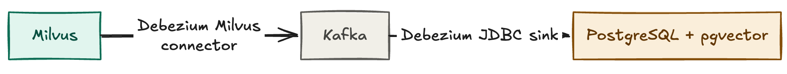

# Streaming from Milvus to PostgreSQL (pgvector)

This example replicates a collection from **Milvus**, a vector database, into **PostgreSQL**
with the [pgvector](https://github.com/pgvector/pgvector) extension through Kafka, using the
Debezium Milvus source connector and the Debezium JDBC sink connector.



## What this example demonstrates

* Capturing changes from a Milvus collection: an initial snapshot, followed by streaming of
  the inserts and deletes that Milvus writes to its message queue.
* Writing them into PostgreSQL with the Debezium JDBC sink connector, which consumes Debezium
  change events directly and therefore needs no transformations.
* Letting the sink connector create the target table, with the `FloatVector` logical type of the
  embeddings mapped to a native pgvector column.

## Prerequisites

Docker with about 8 GB of memory: Milvus runs together with its etcd and MinIO dependencies,
next to Kafka, Kafka Connect and PostgreSQL.

Java 21 and Maven, to build the Milvus connector. It is an incubating connector that is not
released yet and not part of the Debezium Connect image.

Because of that build step the example is not run by a GitHub workflow like the other examples.
`test.yaml` covers the steps below and is meant to be run locally, with
`python3 scripts/run-example-test.py milvus-to-pgvector` from the repository root.

## Running the example

### Build the Milvus connector

Build the connector from [debezium/debezium-connector-milvus](https://github.com/debezium/debezium-connector-milvus)
and unpack the plugin archive into `./plugins`, from where the Compose file mounts it into the
Connect container. The connector builds against a Debezium snapshot, so the main Debezium
repository has to be built first; see the connector's README.

```shell
git clone https://github.com/debezium/debezium-connector-milvus
cd debezium-connector-milvus
mvn clean package -Passembly -Dquick
cd ..

mkdir plugins
tar -xzf debezium-connector-milvus/target/debezium-connector-milvus-*-plugin.tar.gz -C plugins
```

### Start the topology

```shell
docker compose --env-file ../.env -f docker-compose.yaml up -d
```

Milvus takes about a minute to start. It is ready when its health endpoint answers `OK`:

```shell
curl localhost:9091/healthz
```

By then Kafka Connect should list both plugins:

```shell
curl localhost:8083/connector-plugins
```

Look for `MilvusConnector` and `JdbcSinkConnector` in the output. If `MilvusConnector` is missing,
`./plugins/debezium-connector-milvus` is empty: Docker creates an empty directory for a missing
bind mount source instead of failing.

### Prepare source and sink

Create the `products` collection in Milvus and insert four rows. The collection has to exist and
hold data before the connector starts, otherwise there is nothing to snapshot:

```shell
./seed-milvus.sh
```

Now open a `psql` session in a second terminal; the rest of the example uses it:

```shell
docker compose --env-file ../.env -f docker-compose.yaml exec postgres psql -U postgres
```

Enable pgvector, so that the sink connector can create a vector column:

```sql
CREATE EXTENSION vector;
```

### Register the connectors

```shell
# Register the Milvus source connector
curl -i -X POST -H "Accept:application/json" -H "Content-Type:application/json" \
    http://localhost:8083/connectors/ -d @source-milvus.json

# Register the PostgreSQL JDBC sink connector
curl -i -X POST -H "Accept:application/json" -H "Content-Type:application/json" \
    http://localhost:8083/connectors/ -d @sink-postgres.json
```

The source connector snapshots the collection into the topic `milvus.default.products`. The sink
connector creates the `products` table from the schema of the first event and writes the rows.
After a few seconds the table is there in `psql`, with a native vector column:

```sql
\d products
```

```
               Table "public.products"
  Column   |  Type   | Collation | Nullable | Default
-----------+---------+-----------+----------+---------
 pk        | bigint  |           | not null |
 name      | text    |           |          |
 category  | text    |           |          |
 price     | real    |           |          |
 embedding | halfvec |           |          |
Indexes:
    "products_pkey" PRIMARY KEY, btree (pk)
```

And it holds the four rows from the snapshot:

```sql
SELECT * FROM products ORDER BY pk;
```

The embeddings are usable with pgvector's operators, for instance for a nearest neighbour search
by cosine distance:

```sql
SELECT pk, name FROM products ORDER BY embedding <=> '[0.1,0.2,0.3,0.4]' LIMIT 2;
```

### Change data in Milvus

Milvus has no SQL shell, so changes are made through its REST API. Insert a product, upsert it
with a new price, and delete another one:

```shell
curl -X POST localhost:19530/v2/vectordb/entities/insert -H 'Content-Type: application/json' \
    -d '{"collectionName": "products", "data": [{"pk": 1005, "name": "camping stove", "category": "outdoor", "price": 59.99, "embedding": [0.1, 0.3, 0.3, 0.5]}]}'

curl -X POST localhost:19530/v2/vectordb/entities/upsert -H 'Content-Type: application/json' \
    -d '{"collectionName": "products", "data": [{"pk": 1005, "name": "camping stove", "category": "outdoor", "price": 49.99, "embedding": [0.1, 0.3, 0.3, 0.5]}]}'

curl -X POST localhost:19530/v2/vectordb/entities/delete -H 'Content-Type: application/json' \
    -d '{"collectionName": "products", "filter": "pk == 1004"}'
```

Within a few seconds PostgreSQL holds product 1005 at the new price, and product 1004 is gone:

```sql
SELECT pk, name, price FROM products ORDER BY pk;
```

Shut the topology down with:

```shell
docker compose --env-file ../.env -f docker-compose.yaml down -v
```

## Notes on the configuration

### Milvus must use Kafka as its message queue

The connector reads the change stream from the message queue Milvus writes it to, and supports
Kafka only; Milvus deployments backed by Pulsar or RocksMQ cannot be captured. `milvus-user.yaml`
configures Milvus accordingly, pointing it at the same broker Kafka Connect uses. It also limits
Milvus to a single DML channel, so that the collection is on the channel `by-dev-rootcoord-dml_0`
that `milvus.pchannel.name` names; a connector instance consumes one channel.

The connector also needs access to the etcd instance behind Milvus, where Milvus stores the
checkpoint per channel that the snapshot and the start of streaming are anchored on.

`milvus.wire.format` is set to `proto_single`, the message format Milvus 2.5 uses on Kafka,
instead of relying on the connector's auto-detection.

### The sink creates the target table

`"schema.evolution": "basic"` is set, so the sink connector issues the `CREATE TABLE` when the
first record arrives. `"collection.name.format": "products"` names the table, because the default,
the topic name `milvus.default.products`, is not a valid table name.

The `embedding` field carries the `io.debezium.data.FloatVector` logical type, which the sink
maps to pgvector's `halfvec` type, a vector of 16-bit floats. If you need the 32-bit `vector`
type instead, create the table yourself before registering the sink; with `basic` schema
evolution the connector then only adds missing columns.

### Upserts and deletes

Milvus implements an upsert as a delete followed by an insert with the same commit timestamp,
and the connector emits exactly that pair; there are no update (`op=u`) events. Delete events
carry a primary-key-only `before` image, since Milvus does not publish the previous state of a
deleted entity.

`"insert.mode": "upsert"` makes the sink apply snapshot and insert events as
`INSERT ... ON CONFLICT DO UPDATE`, and `"delete.enabled": "true"` together with
`"primary.key.mode": "record_key"` turns delete events into `DELETE` statements keyed by the
record key. Applied in order, the pair emitted for a Milvus upsert leaves a single updated row.

### No transformations

The Debezium JDBC sink connector understands Debezium's change event envelope, so it needs no
`ExtractNewRecordState` transformation to unwrap it. The Connect worker's default JSON converters,
with schemas enabled, are used as they are; the sink derives the primary key from the schema of the
record key.
