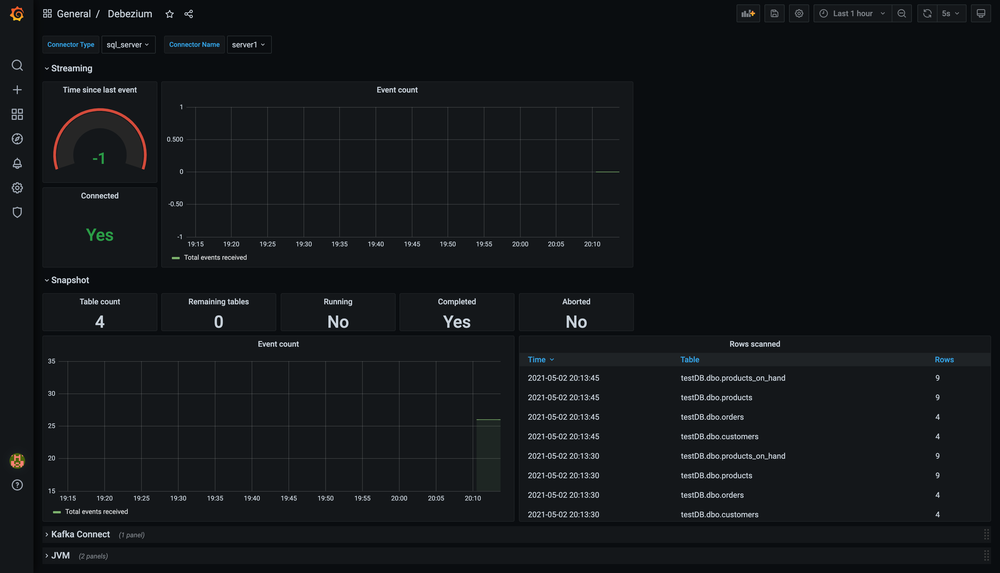

# Monitoring a Debezium instance

Debezium [collects and exports](https://debezium.io/documentation/reference/1.5/operations/monitoring.html) a set of metrics as JMX beans.
Those metrics can be displayed either via an arbitrary JMX console or, for more complex deployments, a Prometheus and Grafana based solution can be deployed.
This example uses a Docker Compose file to set up and deploy Debezium together with all components necessary to monitor it in Grafana.

## Topology

We need following components to collect and present Debezium metrics:

 * Debezium instance with [JMX Exporter](https://github.com/prometheus/jmx_exporter) Java agent installed and configured (see [Docker image](debezium-jmx-exporter))
 * Prometheus instance to collect and store exported metrics (see [Docker image](debezium-prometheus))
 * Grafana instance presenting the metrics (see [Docker image](debezium-grafana))

## Execution

```
export DEBEZIUM_VERSION=2.1
docker-compose up --build

# Initialize database and insert test data
cat inventory.sql | docker exec -i monitoring_sqlserver_1 bash -c '/opt/mssql-tools/bin/sqlcmd -U sa -P $SA_PASSWORD'

# Start SQL Server connector
curl -i -X POST -H "Accept:application/json" -H  "Content-Type:application/json" http://localhost:8083/connectors/ -d @register-sqlserver.json

# Modify records in the database via SQL Server client (do not forget to add `GO` command to execute the statement)
docker-compose exec sqlserver bash -c '/opt/mssql-tools/bin/sqlcmd -U sa -P $SA_PASSWORD -d testDB'
```

Open a web browser and got to the Grafana UI at [http://localhost:3000](http://localhost:3000).
Login into the console as user `admin` with password `admin`.
When asked either change the password (you also can skip this step).
Click on `Home` icon and select *Debezium* dashboard.
You should see a dashboard similar to the one on the screenshot below.



You should see metrics of completed initial snapshot.
When you will modify and create new data in the database, the streaming metrics will be updated too.

When completed, shut down the cluster with this command:

```
docker-compose down
```

## More Dashboards

Another dashboard specifically for monitoring the MySQL connector can be found [here](https://github.com/debezium/debezium-examples/blob/main/monitoring/debezium-grafana/debezium-mysql-connector-dashboard.json)
(see [this post](https://medium.com/searce/grafana-dashboard-for-monitoring-debezium-mysql-connector-d5c28acf905b) to learn more).

If you built awesome dashboards you'd like to share with the Debezium community, please open a pull request for adding them to this repository. Thanks!
