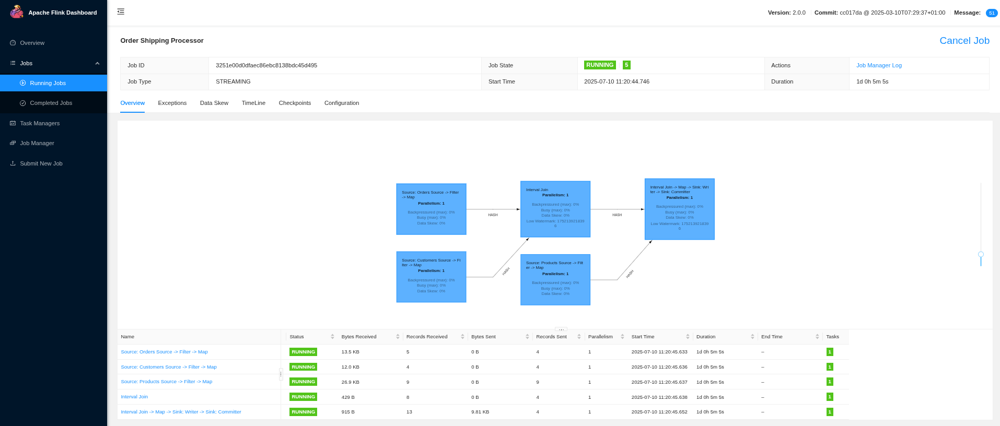
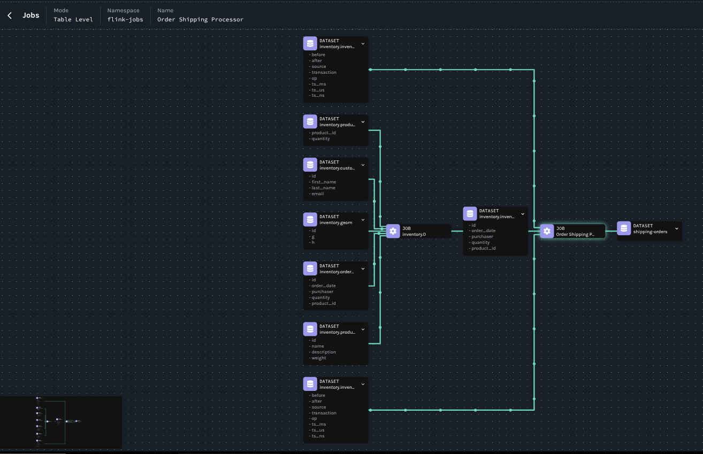

# Complete Data Lineage with Debezium and Flink

This demo showcases how to leverage Debezium OpenLineage support for data lineage tracking in a streaming data pipeline. 
The setup includes a Postgres database, Kafka, Debezium Connect, Apache Flink, and OpenLineage (Marquez) for comprehensive data lineage tracking.

## Architecture Overview

The demo creates an order processing pipeline that:
1. **Data Capture**: Debezium captures real-time changes from three Postgres tables (orders, customers, products)
2. **Stream Processing**: Apache Flink job processes and enriches order data by joining with customer and product information
3. **Data Transformation**: Creates comprehensive shipping orders with calculated total weights and shipping status
4. **Lineage Tracking**: OpenLineage/Marquez tracks the complete data flow from source tables to final output
5. **Output**: Enriched shipping orders are published to a Kafka topic for downstream consumption

### Data Flow Details

The Flink job (`OrderShippingProcessor`) performs the following transformations:

1. **Source Streams**: Reads from three Debezium CDC topics:
    - `inventory.inventory.orders` - Order details (ID, date, purchaser, quantity, product)
    - `inventory.inventory.customers` - Customer information (ID, name, email)
    - `inventory.inventory.products` - Product catalog (ID, name, description, weight)

2. **Stream Processing**:
    - Filters for insert/update/read operations only
    - Extracts relevant data from Debezium CDC format
    - Performs time-windowed joins between orders and customers
    - Joins the enriched data with product information

3. **Data Enrichment**:
    - Combines order data with customer details (name, email)
    - Adds product information (name, description, weight)
    - Calculates total shipping weight (product weight × quantity)
    - Sets shipping status to "READY_TO_SHIP"
    - Adds processing timestamp

4. **Output**: Publishes enriched shipping orders to `shipping-orders` topic as JSON

So given an order information

```
Order: ID=10100, Date=2025-07-18, Purchaser=1002, Quantity=10, Product=103
Customer: ID=1002, Name="John Doe", Email="john@example.com"  
Product: ID=103, Name="Widget", Description="Blue Widget", Weight=1.5
```

the flink job will produce the following

```json
{
  "orderId": 10100,
  "orderDate": "2025-07-18",
  "quantity": 10,
  "productName": "Widget",
  "productDescription": "Blue Widget",
  "productWeight": 1.5,
  "totalWeight": 15.0,
  "customerName": "John Doe",
  "customerEmail": "john@example.com",
  "shippingStatus": "READY_TO_SHIP",
  "processedAt": 1721559123456
}
```

## Prerequisites

- Docker and Docker Compose
- Maven
- [kcctl](https://github.com/kcctl/kcctl) (Kafka Connect CLI)
- jq (for JSON processing)

## Components

- **Postgres**: Source database with inventory data containing three tables:
    - `orders`: Order transactions with purchaser, product, and quantity
    - `customers`: Customer profiles with contact information
    - `products`: Product catalog with descriptions and weights
- **Kafka**: Destination of CDC events
- **Debezium Connector**: Captures database changes and publishes to Kafka topics
- **Apache Flink**: Stream processing engine that joins and enriches order data
- **OpenLineage/Marquez**: Tracks complete data lineage from source tables through transformations to final output

## Step-by-Step Setup

### Build the Flink Job

Navigate to the demo directory and build the Flink job:

```bash
cd debezium-examples/openlinage/debezium-flink
mvn clean package -f flink-job/pom.xml
```

### Start OpenLineage/Marquez

First, clone the Marquez repository if you haven't already:

```bash
git clone https://github.com/MarquezProject/marquez && cd marquez
```

Then start the Marquez backend for data lineage tracking:

```bash
./docker/up.sh --db-port 5433
```

### Start the Demo Infrastructure

Launch all services using Docker Compose:

```bash
docker compose -f docker-compose-flink.yaml up
```

This starts:
- Kafka broker
- Postgres database with sample data
- Debezium Connect
- Flink JobManager and TaskManager

### Connect Marquez to the Network

Connect the Marquez API to the demo network:

```bash
docker network connect debezium-flink_default marquez-api
```

### Verify Kafka Topics

Check available Kafka topics:

```bash
docker compose -f docker-compose-flink.yaml exec kafka /kafka/bin/kafka-topics.sh --list --bootstrap-server kafka:9092
```

### Create Output Topic

Create the `shipping-orders` topic for processed data:

```bash
docker compose -f docker-compose-flink.yaml exec kafka /kafka/bin/kafka-topics.sh --create --bootstrap-server kafka:9092 --replication-factor 1 --partitions 1 --topic shipping-orders
```

### Start Debezium Connector

Apply the Postgres connector configuration:

```bash
kcctl apply -f postgres-connector-openlineage.json
```

### Start the Flink Job

Submit the order processing job to Flink. This job will:
- Read CDC events from orders, customers, and products topics
- Join order data with customer and product information using time windows
- Calculate shipping weights and create enriched shipping orders
- Output the results to the shipping-orders topic

```bash
docker compose -f docker-compose-flink.yaml exec jobmanager bin/flink run -c io.debezium.examples.openlineage.OrderShippingProcessor flink-order-processor-1.0-SNAPSHOT.jar
```

### Verify Data Processing

Check that enriched shipping orders are being created and sent to the output topic. 

```bash
docker compose -f docker-compose-flink.yaml exec kafka ./bin/kafka-console-consumer.sh --bootstrap-server=kafka:9092 --topic shipping-orders --from-beginning --max-messages 1 | jq
```

You should see JSON object containing order details enriched with customer names and product information, like the following:

```json
{
  "orderId": 10001,
  "orderDate": "16816",
  "quantity": 1,
  "productName": "car battery",
  "productDescription": "12V car battery",
  "productWeight": 8.1,
  "totalWeight": 8.1,
  "customerName": "Sally Thomas",
  "customerEmail": "sally.thomas@acme.com",
  "shippingStatus": "READY_TO_SHIP",
  "processedAt": 1752139246887
}
```

### Accessing the UI

Now that all is set up we can check that out Flink job is correctly running via the **Flink Web UI**: http://localhost:8081.
You should see something like the following



and, we can check the lineage graph from the **Marquez UI**: http://localhost:3000.

You should see something similar to the following:



## Simulate a disruptive change

### Apply Updated Configuration

We are going to modify the Debezium connector configuration adding the `ExtraNewREcordState` SMT that will change the produced records, 
extracting from the standard Debezium message schema, only the change part. 

Our Flink job is only designed to process Debezium standard schema, so the job will then skip the unrecognized messages.

Apply the updated connector configuration:

```bash
kcctl apply -f postgres-connector-openlineage-update.json
```

Insert new data to trigger change events:

```bash
docker compose -f docker-compose-flink.yaml exec postgres psql -Upostgres -c "insert into inventory.orders values(10100, '2025-07-18', 1002, 10, 103);"
```

### Monitor Processed Data

Watch the shipping orders topic for new processed data:

```bash
docker compose -f docker-compose-flink.yaml exec kafka ./bin/kafka-console-consumer.sh --bootstrap-server=kafka:9092 --topic shipping-orders --from-beginning | jq
```
 you should see something like the following:

```json
{
  "orderId": 10001,
  "orderDate": "16816",
  "quantity": 1,
  "productName": "car battery",
  "productDescription": "12V car battery",
  "productWeight": 8.1,
  "totalWeight": 8.1,
  "customerName": "Sally Thomas",
  "customerEmail": "sally.thomas@acme.com",
  "shippingStatus": "READY_TO_SHIP",
  "processedAt": 1752139246887
}
{
  "orderId": 10002,
  "orderDate": "16817",
  "quantity": 2,
  "productName": "hammer",
  "productDescription": "14oz carpenter's hammer",
  "productWeight": 0.875,
  "totalWeight": 1.75,
  "customerName": "George Bailey",
  "customerEmail": "gbailey@foobar.com",
  "shippingStatus": "READY_TO_SHIP",
  "processedAt": 1752139246898
}
{
  "orderId": 10003,
  "orderDate": "16850",
  "quantity": 2,
  "productName": "hammer",
  "productDescription": "16oz carpenter's hammer",
  "productWeight": 1.0,
  "totalWeight": 2.0,
  "customerName": "George Bailey",
  "customerEmail": "gbailey@foobar.com",
  "shippingStatus": "READY_TO_SHIP",
  "processedAt": 1752139246901
}
{
  "orderId": 10004,
  "orderDate": "16852",
  "quantity": 1,
  "productName": "rocks",
  "productDescription": "box of assorted rocks",
  "productWeight": 5.3,
  "totalWeight": 5.3,
  "customerName": "Edward Walker",
  "customerEmail": "ed@walker.com",
  "shippingStatus": "READY_TO_SHIP",
  "processedAt": 1752139246901
}
```

you can note that the order `10100` is not present.

## Investigating the issue with Data Lineage support

Let's start the investigation using lineage metadata.

### List job's runs

```bash
curl "http://localhost:5000/api/v1/namespaces/inventory/jobs/inventory.0/runs" | jq '.runs | map({"id": .id, "state": .state})'
```

```json
[
  {
    "id": "0197f3a3-6f97-787a-bd19-43313c9fef0a",
    "state": "RUNNING"
  },
  {
    "id": "0197f3a3-0a6a-7145-8c8b-e6040636c504",
    "state": "COMPLETED"
  }
]
```

we have two runs since we have updated our Debezium connector, this is a first clue that something is changed. 

So let's put aside the two run ids. 

```bash
CURRENT_RUN_ID=$(curl "http://localhost:5000/api/v1/namespaces/inventory/jobs/inventory.0/runs" | jq -r '.runs[0].id')  
PREVIOUS_RUN_ID=$(curl "http://localhost:5000/api/v1/namespaces/inventory/jobs/inventory.0/runs" | jq -r '.runs[1].id')
```

### Compare Job Versions

Extract and compare current and previous job's run version:

```bash
diff <(curl -s "http://localhost:5000/api/v1/jobs/runs/$CURRENT_RUN_ID" | jq -r '.jobVersion.version') \
     <(curl -s "http://localhost:5000/api/v1/jobs/runs/$PREVIOUS_RUN_ID" | jq -r '.jobVersion.version')
```

```text
1c1
< 9f65dbeb-3949-3ca0-8b15-1fc733d51c1d
---
> bd448c97-fbbe-3398-be31-f6f19b137a56
```
since the two run has different version means that something has changed, so not just a simple restart og the job. 

Let's keep a part the versions.

```bash
CURRENT_JOB_VERSION=$(curl -s "http://localhost:5000/api/v1/jobs/runs/$CURRENT_RUN_ID" | jq -r '.jobVersion.version')  
PREVIOUS_JOB_VERSION=$(curl -s "http://localhost:5000/api/v1/jobs/runs/$PREVIOUS_RUN_ID" | jq -r '.jobVersion.version')
```

### Analyze what changed

```bash
diff <(curl -s "http://localhost:5000/api/v1/namespaces/inventory/jobs/inventory.0/versions/$CURRENT_JOB_VERSION" | \
jq 'del(.["id", "version", "createdAt", "updatedAt", "latestRun"])') \
<(curl -s "http://localhost:5000/api/v1/namespaces/inventory/jobs/inventory.0/versions/$PREVIOUS_JOB_VERSION" | \
jq 'del(.["id", "version", "createdAt", "updatedAt", "latestRun"])')
```

```text
12,15d11
<       "name": "inventory.orders"
<     },
<     {
<       "namespace": "postgres://postgres:5432",
24a21,24
>     },
>     {
>       "namespace": "postgres://postgres:5432",
>       "name": "inventory.orders"
27a28,43
>     {
>       "namespace": "kafka://kafka:9092",
>       "name": "inventory.inventory.geom"
>     },
>     {
>       "namespace": "kafka://kafka:9092",
>       "name": "inventory.inventory.products"
>     },
>     {
>       "namespace": "kafka://kafka:9092",
>       "name": "inventory.inventory.customers"
>     },
>     {
>       "namespace": "kafka://kafka:9092",
>       "name": "inventory.inventory.products_on_hand"
>     },
```

from this we can clearly see that something related to the dataset is changed, so let's dig a little bit more retrieving the dataset versions

```bash
CURRENT_DATASET_VERSION=$(curl -s "http://localhost:5000/api/v1/jobs/runs/$CURRENT_RUN_ID" | jq -r '.outputDatasetVersions[0].datasetVersionId.version')  
PREVIOUS_DATASET_VERSION=$(curl -s "http://localhost:5000/api/v1/jobs/runs/$PREVIOUS_RUN_ID" | jq -r '.outputDatasetVersions[2].datasetVersionId.version')
```

so that we can compare the difference between the two version with:

```bash
diff <(curl -s "http://localhost:5000/api/v1/namespaces/kafka%3A%2F%2Fkafka%3A9092/datasets/inventory.inventory.orders/versions" | \
jq --arg target_version "$CURRENT_DATASET_VERSION" '.versions[] | select(.createdByRun.outputDatasetVersions[]?.datasetVersionId.version == $target_version) | del(.["id", "version", "createdAt", "createdByRun"])') \
<(curl -s "http://localhost:5000/api/v1/namespaces/kafka%3A%2F%2Fkafka%3A9092/datasets/inventory.inventory.orders/versions" | \
jq --arg target_version "$PREVIOUS_DATASET_VERSION" '.versions[] | select(.createdByRun.outputDatasetVersions[]?.datasetVersionId.version == $target_version) | del(.["id", "version", "createdAt", "createdByRun"])')
```

```text
9,10c9,10
<       "name": "id",
<       "type": "INT32",
---
>       "name": "before",
>       "type": "STRUCT",
15,16c15,16
<       "name": "order_date",
<       "type": "INT32",
---
>       "name": "after",
>       "type": "STRUCT",
21,22c21,22
<       "name": "purchaser",
<       "type": "INT32",
---
>       "name": "source",
>       "type": "STRUCT",
27,28c27,28
<       "name": "quantity",
<       "type": "INT32",
---
>       "name": "transaction",
>       "type": "STRUCT",
33,34c33,52
<       "name": "product_id",
<       "type": "INT32",
---
>       "name": "op",
>       "type": "STRING",
>       "tags": [],
>       "description": null
>     },
>     {
>       "name": "ts_ms",
>       "type": "INT64",
>       "tags": [],
>       "description": null
>     },
>     {
>       "name": "ts_us",
>       "type": "INT64",
>       "tags": [],
>       "description": null
>     },
>     {
>       "name": "ts_ns",
>       "type": "INT64",
42c60
<   "currentSchemaVersion": "f7874ec9-3a90-334f-8930-233a3c1bced3",
---
>   "currentSchemaVersion": "5d49a53b-2116-3216-9b84-7f9850cc6f4e",
47,48c65,88
<           "name": "id",
<           "type": "INT32"
---
>           "name": "before",
>           "type": "STRUCT",
>           "fields": [
>             {
>               "name": "id",
>               "type": "INT32"
>             },
>             {
>               "name": "order_date",
>               "type": "INT32"
>             },
>             {
>               "name": "purchaser",
>               "type": "INT32"
>             },
>             {
>               "name": "quantity",
>               "type": "INT32"
>             },
>             {
>               "name": "product_id",
>               "type": "INT32"
>             }
>           ]
51,52c91,114
<           "name": "order_date",
<           "type": "INT32"
---
>           "name": "after",
>           "type": "STRUCT",
>           "fields": [
>             {
>               "name": "id",
>               "type": "INT32"
>             },
>             {
>               "name": "order_date",
>               "type": "INT32"
>             },
>             {
>               "name": "purchaser",
>               "type": "INT32"
>             },
>             {
>               "name": "quantity",
>               "type": "INT32"
>             },
>             {
>               "name": "product_id",
>               "type": "INT32"
>             }
>           ]
55,56c117,176
<           "name": "purchaser",
<           "type": "INT32"
---
>           "name": "source",
>           "type": "STRUCT",
>           "fields": [
>             {
>               "name": "version",
>               "type": "STRING"
>             },
>             {
>               "name": "connector",
>               "type": "STRING"
>             },
>             {
>               "name": "name",
>               "type": "STRING"
>             },
>             {
>               "name": "ts_ms",
>               "type": "INT64"
>             },
>             {
>               "name": "snapshot",
>               "type": "STRING"
>             },
>             {
>               "name": "db",
>               "type": "STRING"
>             },
>             {
>               "name": "sequence",
>               "type": "STRING"
>             },
>             {
>               "name": "ts_us",
>               "type": "INT64"
>             },
>             {
>               "name": "ts_ns",
>               "type": "INT64"
>             },
>             {
>               "name": "schema",
>               "type": "STRING"
>             },
>             {
>               "name": "table",
>               "type": "STRING"
>             },
>             {
>               "name": "txId",
>               "type": "INT64"
>             },
>             {
>               "name": "lsn",
>               "type": "INT64"
>             },
>             {
>               "name": "xmin",
>               "type": "INT64"
>             }
>           ]
59,60c179,194
<           "name": "quantity",
<           "type": "INT32"
---
>           "name": "transaction",
>           "type": "STRUCT",
>           "fields": [
>             {
>               "name": "id",
>               "type": "STRING"
>             },
>             {
>               "name": "total_order",
>               "type": "INT64"
>             },
>             {
>               "name": "data_collection_order",
>               "type": "INT64"
>             }
>           ]
63,64c197,210
<           "name": "product_id",
<           "type": "INT32"
---
>           "name": "op",
>           "type": "STRING"
>         },
>         {
>           "name": "ts_ms",
>           "type": "INT64"
>         },
>         {
>           "name": "ts_us",
>           "type": "INT64"
>         },
>         {
>           "name": "ts_ns",
>           "type": "INT64"
74a221,225
>     },
>     "symlinks": {
>       "_producer": "https://github.com/OpenLineage/OpenLineage/tree/1.34.0/integration/flink",
>       "_schemaURL": "https://openlineage.io/spec/facets/1-0-1/SymlinksDatasetFacet.json#/$defs/SymlinksDatasetFacet",
>       "identifiers": []
```

It's clear now that there was a schema change!

Let's now get the job versions that created the two dataset versions

```bash
diff <(curl -s "http://localhost:5000/api/v1/namespaces/kafka%3A%2F%2Fkafka%3A9092/datasets/inventory.inventory.orders/versions" | \
jq --arg target_version "$CURRENT_DATASET_VERSION" '.versions[] | select(.createdByRun.outputDatasetVersions[]?.datasetVersionId.version == $target_version) | .createdByRun.jobVersion') \
<(curl -s "http://localhost:5000/api/v1/namespaces/kafka%3A%2F%2Fkafka%3A9092/datasets/inventory.inventory.orders/versions" | \
jq --arg target_version "$PREVIOUS_DATASET_VERSION" '.versions[] | select(.createdByRun.outputDatasetVersions[]?.datasetVersionId.version == $target_version) | .createdByRun.jobVersion')
```

```text
<   "version": "9f65dbeb-3949-3ca0-8b15-1fc733d51c1d"
---
>   "version": "bd448c97-fbbe-3398-be31-f6f19b137a56"
```

So take note of job version ids and use them to check what has changed

```bash
diff <(curl -s "http://localhost:5000/api/v1/namespaces/inventory/jobs/inventory.0" | \
jq --arg target_version "9f65dbeb-3949-3ca0-8b15-1fc733d51c1d" '.latestRuns[] | select(.jobVersion.version == $target_version) | del(.["id", "version", "createdAt", "updatedAt", "latestRun"])') \
<(curl -s "http://localhost:5000/api/v1/namespaces/inventory/jobs/inventory.0" | \
jq --arg target_version "bd448c97-fbbe-3398-be31-f6f19b137a56" '.latestRuns[] | select(.jobVersion.version == $target_version) | del(.["id", "version", "createdAt", "updatedAt", "latestRun"])')
```

```text
4,7c4,7
<   "state": "RUNNING",
<   "startedAt": "2025-07-10T09:21:12.985879Z",
<   "endedAt": null,
<   "durationMs": null,
---
>   "state": "COMPLETED",
>   "startedAt": "2025-07-10T09:20:39.231621Z",
>   "endedAt": "2025-07-10T09:21:03.860Z",
>   "durationMs": 24629,
12c12
<     "version": "9f65dbeb-3949-3ca0-8b15-1fc733d51c1d"
---
>     "version": "bd448c97-fbbe-3398-be31-f6f19b137a56"
59a60,75
>         "name": "inventory.inventory.customers",
>         "version": "46b86c1e-162d-3155-aecc-6bb6f8f35128"
>       },
>       "facets": {}
>     },
>     {
>       "datasetVersionId": {
>         "namespace": "kafka://kafka:9092",
>         "name": "inventory.inventory.geom",
>         "version": "80413cf4-dce5-3fec-8e86-322b6a35c8df"
>       },
>       "facets": {}
>     },
>     {
>       "datasetVersionId": {
>         "namespace": "kafka://kafka:9092",
61c77,93
<         "version": "5bc1a4b7-4568-37cf-880b-507139865500"
---
>         "version": "2c23ea5c-8349-3484-afe4-f70ed6c283d3"
>       },
>       "facets": {}
>     },
>     {
>       "datasetVersionId": {
>         "namespace": "kafka://kafka:9092",
>         "name": "inventory.inventory.products",
>         "version": "3a9f3ec2-5a42-3bad-a658-9351b3a45311"
>       },
>       "facets": {}
>     },
>     {
>       "datasetVersionId": {
>         "namespace": "kafka://kafka:9092",
>         "name": "inventory.inventory.products_on_hand",
>         "version": "c5a10775-a191-3e8f-a548-3aaab54defcf"
85c117
<         "transforms=unwrap,openlineage",
---
>         "transforms=openlineage",
95d126
<         "transforms.unwrap.type=io.debezium.transforms.ExtractNewRecordState",
```

looking to the last part, we can effectively see that `io.debezium.transforms.ExtractNewRecordState` has been added. 
This is the root cause of the problem!

## Cleanup

To clean up all resources:

```bash
docker compose -f docker-compose-flink.yaml down
docker rmi debezium/flink-job
docker volume ls | grep marquez | awk '{print $2}' | xargs docker volume rm
```

## Troubleshooting

- Ensure all ports are available (5432, 5433, 8081, 8083, 9092)
- Check Docker logs if services fail to start
- Verify network connectivity between containers
- Use the investigation commands to debug lineage issues

This demo provides a complete end-to-end example of modern data streaming with comprehensive lineage tracking, making it ideal for understanding how to implement observable data pipelines in production environments.