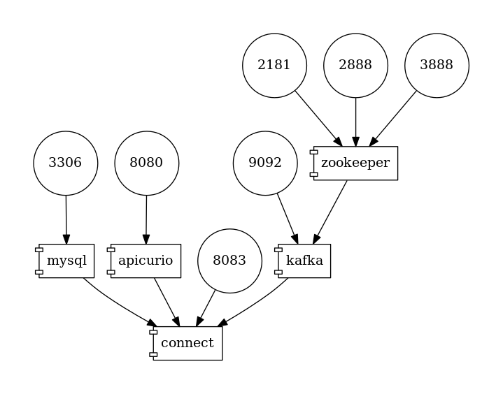
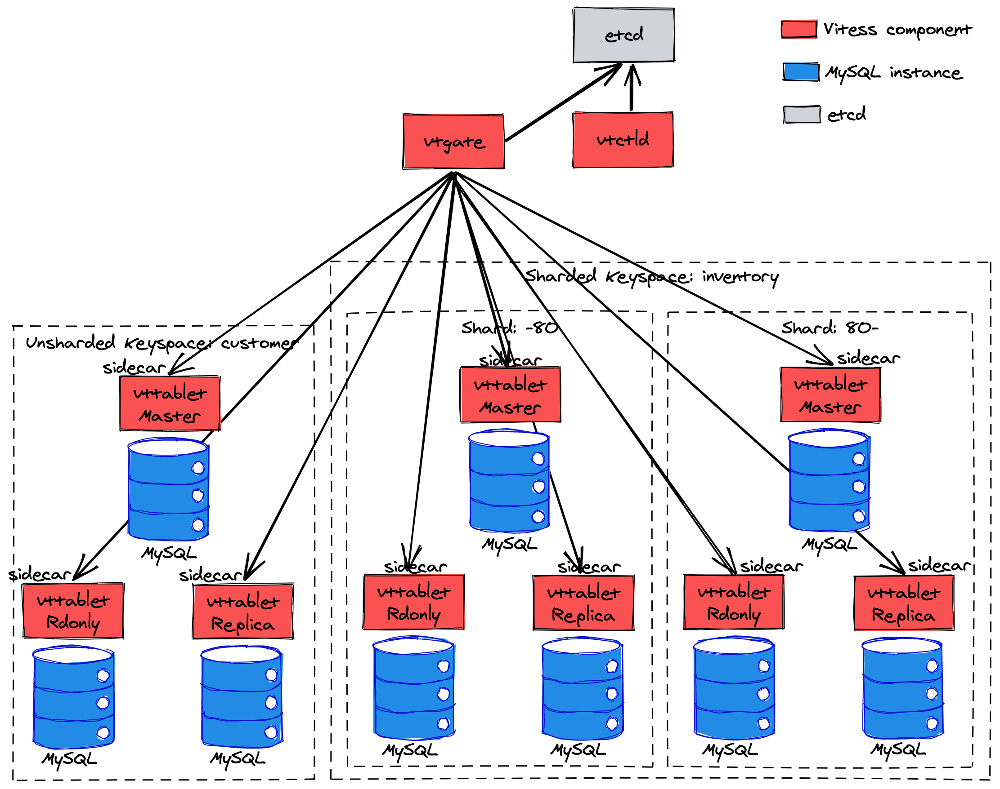

# Debezium Tutorial

This demo automatically deploys the topology of services as defined in the [Debezium Tutorial](https://debezium.io/documentation/reference/stable/tutorial.html).

- [Debezium Tutorial](#debezium-tutorial)
  * [Using MySQL](#using-mysql)
    + [Using MySQL and the Avro message format](#using-mysql-and-the-avro-message-format)
      - [Kafka Connect Worker configuration](#kafka-connect-worker-configuration)
      - [Debezium Connector configuration](#debezium-connector-configuration)
    + [Using MySQL and Apicurio Registry](#using-mysql-and-apicurio-registry)
      - [JSON format](#json-format)
      - [Avro format using Apicurio Avro converter](#avro-format-using-apicurio-avro-converter)
      - [Avro format using Confluent Avro converter](#avro-format-using-confluent-avro-converter)
  * [Using Postgres](#using-postgres)
  * [Using MongoDB](#using-mongodb)
  * [Using Oracle](#using-oracle)
  * [Using SQL Server](#using-sql-server)
  * [Using Db2](#using-db2)
  * [Using Cassandra](#using-cassandra)
  * [Using Vitess](#using-vitess)
  * [Using TimescaleDB](#using-timescaledb)
  * [Using Informix](#using-informix)
  * [Using externalized secrets](#using-externalized-secrets)
  * [Running without ZooKeeper](#running-without-zookeeper)
  * [Debugging](#debugging)

## Using MySQL

```shell
# Start the topology as defined in https://debezium.io/documentation/reference/stable/tutorial.html
export DEBEZIUM_VERSION=2.1
docker-compose -f docker-compose-mysql.yaml up

# Start MySQL connector
curl -i -X POST -H "Accept:application/json" -H  "Content-Type:application/json" http://localhost:8083/connectors/ -d @register-mysql.json

# Consume messages from a Debezium topic
docker-compose -f docker-compose-mysql.yaml exec kafka /kafka/bin/kafka-console-consumer.sh \
    --bootstrap-server kafka:9092 \
    --from-beginning \
    --property print.key=true \
    --topic dbserver1.inventory.customers

# Modify records in the database via MySQL client
docker-compose -f docker-compose-mysql.yaml exec mysql bash -c 'mysql -u $MYSQL_USER -p$MYSQL_PASSWORD inventory'

# Shut down the cluster
docker-compose -f docker-compose-mysql.yaml down
```

### Using MySQL and the Avro message format

To use [Avro-style messages](https://debezium.io/documentation/reference/stable/configuration/avro.html) instead of JSON,
Avro can be configured one of two ways, 
in the Kafka Connect worker configuration or in the connector configuration.
Using Avro in conjunction with the schema registry allows for much more compact messages.

#### Kafka Connect Worker configuration

Configuring Avro at the Kafka Connect worker involves using the same steps above for MySQL but instead using the _docker-compose-mysql-avro-worker.yaml_ configuration file instead.
The Compose file configures the Connect service to use the Avro (de-)serializers for the Connect instance and starts one more additional service, the Confluent schema registry.

#### Debezium Connector configuration

Configuring Avro at the Debezium Connector involves specifying the converter and schema registry as a part of the connectors configuration.
To do this, follow the same steps above for MySQL but instead using the _docker-compose-mysql-avro-connector.yaml_ and _register-mysql-avro.json_ configuration files.
The Compose file configures the Connect service to use the default (de-)serializers for the Connect instance and starts one additional service, the Confluent schema registry.
The connector configuration file configures the connector but explicitly sets the (de-)serializers for the connector to use Avro and specifies the location of the schema registry.

You can access the first version of the schema for `customers` values like so:

```shell
curl -X GET http://localhost:8081/subjects/dbserver1.inventory.customers-value/versions/1
```

Or, if you have the `jq` utility installed, you can get a formatted output like this:

```shell
curl -X GET http://localhost:8081/subjects/dbserver1.inventory.customers-value/versions/1 | jq '.schema | fromjson'
```

If you alter the structure of the `customers` table in the database and trigger another change event,
a new version of that schema will be available in the registry.

The service registry also comes with a console consumer that can read the Avro messages:

```shell
docker-compose -f docker-compose-mysql-avro-worker.yaml exec schema-registry /usr/bin/kafka-avro-console-consumer \
    --bootstrap-server kafka:9092 \
    --from-beginning \
    --property print.key=true \
    --property schema.registry.url=http://schema-registry:8081 \
    --topic dbserver1.inventory.customers
```

### Using MySQL and Apicurio Registry

[Apicurio Registry](https://github.com/Apicurio/apicurio-registry) is an open-source API and schema registry that amongst other things can be used to store schemas of Kafka records.
It provides

* its own native Avro converter and Protobuf serializer
* a JSON converter that exports its schema into the registry
* a compatibility layer with other schema registries such as IBM's or Confluent's; it can be used with the Confluent Avro converter.

For the Apicurio examples we will use the following deployment topology:



#### JSON format

Configuring JSON converter with externalized schema at the Debezium Connector involves specifying the converter and schema registry as a part of the connectors configuration.
To do this, follow the same steps above for MySQL but instead using the _docker-compose-mysql-apicurio.yaml_ and _register-mysql-apicurio-converter-json.json_ configuration files.
The Compose file configures the Connect service to use the default (de-)serializers for the Connect instance and starts one additional service, the Apicurio Registry.
The connector configuration file configures the connector but explicitly sets the (de-)serializers for the connector to use Avro and specifies the location of the Apicurio registry.

You can access the first version of the schema for `customers` values like so:

```shell
curl -X GET http://localhost:8080/apis/registry/v2/groups/default/artifacts/dbserver1.inventory.customers-value
```

Or, if you have the `jq` utility installed, you can get a formatted output like this:

```shell
curl -X GET http://localhost:8080/apis/registry/v2/groups/default/artifacts/dbserver1.inventory.customers-value | jq .
```

If you alter the structure of the `customers` table in the database and trigger another change event,
a new version of that schema will be available in the registry.

You can consume the JSON messages in the same way as with standard JSON converter

```shell
docker-compose -f docker-compose-mysql-apicurio.yaml exec kafka /kafka/bin/kafka-console-consumer.sh \
    --bootstrap-server kafka:9092 \
    --from-beginning \
    --property print.key=true \
    --topic dbserver1.inventory.customers
```

When you look at the data message you will notice that it contains only `payload` but not `schema` part as this is externalized into the registry.

#### Avro format using Apicurio Avro converter

Configuring Avro at the Debezium Connector involves specifying the converter and schema registry as a part of the connectors configuration.
To do this, follow the same steps above for MySQL but instead using the _docker-compose-mysql-apicurio.yaml_ and _register-mysql-apicurio-converter-avro.json_ configuration files.
The Compose file configures the Connect service to use the default (de-)serializers for the Connect instance and starts one additional service, the Apicurio Registry.
The connector configuration file configures the connector but explicitly sets the (de-)serializers for the connector to use Avro and specifies the location of the Apicurio registry.

You can access the first version of the schema for `customers` values like so:

```shell
curl -X GET http://localhost:8080/apis/registry/v2/groups/default/artifacts/dbserver1.inventory.customers-value
```

Or, if you have the `jq` utility installed, you can get a formatted output like this:

```shell
curl -X GET http://localhost:8080/apis/registry/v2/groups/default/artifacts/dbserver1.inventory.customers-value | jq .
```

If you alter the structure of the `customers` table in the database and trigger another change event,
a new version of that schema will be available in the registry.

#### Avro format using Confluent Avro converter

Configuring Avro at the Debezium Connector involves specifying the converter and schema registry as a part of the connectors configuration.
To do this, follow the same steps above for MySQL but instead using the _docker-compose-mysql-apicurio.yaml_ and _register-mysql-apicurio.json_ configuration files.
The Compose file configures the Connect service to use the default (de-)serializers for the Connect instance and starts one additional service, the Apicurio Registry.
The connector configuration file configures the connector but explicitly sets the (de-)serializers for the connector to use Avro and specifies the location of the Apicurio registry.

You can access the first version of the schema for `customers` values like so:

```shell
curl -X GET http://localhost:8080/apis/ccompat/v6/subjects/dbserver1.inventory.customers-value/versions/1
```

Or, if you have the `jq` utility installed, you can get a formatted output like this:

```shell
curl -X GET http://localhost:8080/apis/ccompat/v6/subjects/dbserver1.inventory.customers-value/versions/1 | jq '.schema | fromjson'
```

If you alter the structure of the `customers` table in the database and trigger another change event,
a new version of that schema will be available in the registry.

To consume the Avro messages It is possible to use `kafkacat` tool:

```shell
docker run --rm --tty \
  --network tutorial_default \
  quay.io/debezium/tooling:1.2 \
  kafkacat -b kafka:9092 -C -o beginning -q -s value=avro -r http://apicurio:8080/apis/ccompat/v6 \
  -t dbserver1.inventory.customers | jq .
```

## Using Postgres

```shell
# Start the topology as defined in https://debezium.io/documentation/reference/stable/tutorial.html
export DEBEZIUM_VERSION=2.1
docker-compose -f docker-compose-postgres.yaml up

# Start Postgres connector
curl -i -X POST -H "Accept:application/json" -H  "Content-Type:application/json" http://localhost:8083/connectors/ -d @register-postgres.json

# Consume messages from a Debezium topic
docker-compose -f docker-compose-postgres.yaml exec kafka /kafka/bin/kafka-console-consumer.sh \
    --bootstrap-server kafka:9092 \
    --from-beginning \
    --property print.key=true \
    --topic dbserver1.inventory.customers

# Modify records in the database via Postgres client
docker-compose -f docker-compose-postgres.yaml exec postgres env PGOPTIONS="--search_path=inventory" bash -c 'psql -U $POSTGRES_USER postgres'

# Shut down the cluster
docker-compose -f docker-compose-postgres.yaml down
```

## Using MongoDB

```shell
# Start the topology as defined in https://debezium.io/documentation/reference/stable/tutorial.html
export DEBEZIUM_VERSION=2.1
docker-compose -f docker-compose-mongodb.yaml up

# Initialize MongoDB replica set and insert some test data
docker-compose -f docker-compose-mongodb.yaml exec mongodb bash -c '/usr/local/bin/init-inventory.sh'

# Start MongoDB connector
curl -i -X POST -H "Accept:application/json" -H  "Content-Type:application/json" http://localhost:8083/connectors/ -d @register-mongodb.json

# Consume messages from a Debezium topic
docker-compose -f docker-compose-mongodb.yaml exec kafka /kafka/bin/kafka-console-consumer.sh \
    --bootstrap-server kafka:9092 \
    --from-beginning \
    --property print.key=true \
    --topic dbserver1.inventory.customers

# Modify records in the database via MongoDB client
docker-compose -f docker-compose-mongodb.yaml exec mongodb bash -c 'mongo -u $MONGODB_USER -p $MONGODB_PASSWORD --authenticationDatabase admin inventory'

db.customers.insert([
    { _id : NumberLong("1005"), first_name : 'Bob', last_name : 'Hopper', email : 'thebob@example.com', unique_id : UUID() }
]);

# Shut down the cluster
docker-compose -f docker-compose-mongodb.yaml down
```

## Using Oracle

This assumes Oracle is running on localhost
(or is reachable there, e.g. by means of running it within a VM or Docker container with appropriate port configurations)
and set up with the configuration, users and grants described in the Debezium [Vagrant set-up](https://github.com/debezium/oracle-vagrant-box).

```shell
# Start the topology as defined in https://debezium.io/documentation/reference/stable/tutorial.html
export DEBEZIUM_VERSION=2.1
docker-compose -f docker-compose-oracle.yaml up --build

# Insert test data
cat debezium-with-oracle-jdbc/init/inventory.sql | docker exec -i dbz_oracle sqlplus debezium/dbz@//localhost:1521/ORCLPDB1
```

The Oracle connector can be used to interact with Oracle either using the Oracle LogMiner API or the Oracle XStreams API.

### LogMiner

The connector by default will use Oracle LogMiner.
Adjust the host name of the database server in the `register-oracle-logminer.json` as per your environment.
Then register the Debezium Oracle connector:

```shell
# Start Oracle connector
curl -i -X POST -H "Accept:application/json" -H  "Content-Type:application/json" http://localhost:8083/connectors/ -d @register-oracle-logminer.json

# Create a test change record
echo "INSERT INTO customers VALUES (NULL, 'John', 'Doe', 'john.doe@example.com');" | docker exec -i dbz_oracle sqlplus debezium/dbz@//localhost:1521/ORCLPDB1

# Consume messages from a Debezium topic
docker-compose -f docker-compose-oracle.yaml exec kafka /kafka/bin/kafka-console-consumer.sh \
    --bootstrap-server kafka:9092 \
    --from-beginning \
    --property print.key=true \
    --topic server1.DEBEZIUM.CUSTOMERS

# Modify other records in the database via Oracle client
docker exec -i dbz_oracle sqlplus debezium/dbz@//localhost:1521/ORCLPDB1

# Shut down the cluster
docker-compose -f docker-compose-oracle.yaml down
```

## Using SQL Server

```shell
# Start the topology as defined in https://debezium.io/documentation/reference/stable/tutorial.html
export DEBEZIUM_VERSION=2.1
docker-compose -f docker-compose-sqlserver.yaml up

# Initialize database and insert test data
cat debezium-sqlserver-init/inventory.sql | docker-compose -f docker-compose-sqlserver.yaml exec -T sqlserver bash -c '/opt/mssql-tools/bin/sqlcmd -U sa -P $SA_PASSWORD'

# Start SQL Server connector
curl -i -X POST -H "Accept:application/json" -H  "Content-Type:application/json" http://localhost:8083/connectors/ -d @register-sqlserver.json

# Consume messages from a Debezium topic
docker-compose -f docker-compose-sqlserver.yaml exec kafka /kafka/bin/kafka-console-consumer.sh \
    --bootstrap-server kafka:9092 \
    --from-beginning \
    --property print.key=true \
    --topic server1.testDB.dbo.customers

# Modify records in the database via SQL Server client (do not forget to add `GO` command to execute the statement)
docker-compose -f docker-compose-sqlserver.yaml exec sqlserver bash -c '/opt/mssql-tools/bin/sqlcmd -U sa -P $SA_PASSWORD -d testDB'

# Shut down the cluster
docker-compose -f docker-compose-sqlserver.yaml down
```

## Using Db2

```shell
# Start the topology as defined in https://debezium.io/documentation/reference/stable/tutorial.html
export DEBEZIUM_VERSION=2.1

docker-compose -f docker-compose-db2.yaml up --build

# Start DB2 connector
curl -i -X POST -H "Accept:application/json" -H  "Content-Type:application/json" http://localhost:8083/connectors/ -d @register-db2.json

# Consume messages from a Debezium topic
docker-compose -f docker-compose-db2.yaml exec kafka /kafka/bin/kafka-console-consumer.sh \
    --bootstrap-server kafka:9092 \
    --from-beginning \
    --property print.key=true \
    --topic db2server.DB2INST1.CUSTOMERS

# Modify records in the database via DB2 client
docker-compose -f docker-compose-db2.yaml exec db2server bash -c 'su - db2inst1'
db2 connect to TESTDB
db2 "INSERT INTO DB2INST1.CUSTOMERS(first_name, last_name, email) VALUES ('John', 'Doe', 'john.doe@example.com');"
# Shut down the cluster
docker-compose -f docker-compose-db2.yaml down
```

## Using Cassandra

```shell 
# Start the topology as defined in https://debezium.io/documentation/reference/stable/tutorial.html
export DEBEZIUM_VERSION=2.1

docker-compose -f docker-compose-cassandra.yaml up --build

# Consume messages from a Debezium topic
docker-compose -f docker-compose-cassandra.yaml exec kafka /kafka/bin/kafka-console-consumer.sh \
    --bootstrap-server kafka:9092 \
    --from-beginning \
    --property print.key=true \
    --topic test_prefix.testdb.customers

# Modify records in the database via Cassandra client (note the TX logs will only be flushed out,
and thus be picked up by the connector, after accumulating 1 MB of changes)

docker-compose -f docker-compose-cassandra.yaml exec cassandra bash -c 'cqlsh --keyspace=testdb'

INSERT INTO customers(id,first_name,last_name,email) VALUES (5,'Roger','Poor','roger@poor.com');
UPDATE customers set first_name = 'Barry' where id = 5;
DELETE FROM customers WHERE id = 5;

# Shut down the cluster
docker-compose -f docker-compose-cassandra.yaml down
```

## Using Vitess

```shell 
# Start the topology as defined in https://debezium.io/documentation/reference/stable/tutorial.html
export DEBEZIUM_VERSION=2.1

docker-compose -f docker-compose-vitess.yaml up --build

# Start Vitess connector
curl -i -X POST -H "Accept:application/json" -H  "Content-Type:application/json" http://localhost:8083/connectors/ -d @register-vitess.json

# Consume messages from a Debezium topic
docker-compose -f docker-compose-vitess.yaml exec kafka /kafka/bin/kafka-console-consumer.sh \
    --bootstrap-server kafka:9092 \
    --from-beginning \
    --property print.key=true \
    --topic dbserver1.inventory.products

# Modify records in the database via MySQL client
docker-compose -f docker-compose-vitess.yaml exec vitess bash -c 'mysql -h 127.0.0.1 -P 15306 inventory'

INSERT INTO products (name, description, weight) VALUES ('Debezium in Action', 'Book', 10);
UPDATE products SET description = 'Video' WHERE id = 1000;
DELETE FROM products WHERE id = 1000;

# Shut down the cluster
docker-compose -f docker-compose-vitess.yaml down
```

In this example, the Vitess setup has 2 keyspaces (a.k.a. schemas in MySQL's term):

- 1 unsharded keyspace: `customer`, which contains 1 table `customer`, and some technical Sequence tables used by Vitess itself.
- 1 sharded keyspace: `inventory`, which contains 3 tables `products`, `products_on_hand` and `orders`. This sharded keyspace has 2 shards (`-80` and `80-`), the sharding key is the product id column of each of the 3 tables, this is, the `id` column in the `products` table, the `product_id` column in the `products_on_hand` table, the `product_id` column in the `orders` table. 

The unsharded keyspace `customer` has only 1 shard, the sharded keyspace `inventory` has 2 shards. Each shard consists of their own MySQL cluster that has 3 MySQL processes: 1 master and 2 replicas. Vitess uses 1 instance of `vttablet` as the sidecar for each MySQL process.

There are 3 other Vitess processes running in the same container: `vtgate`, `vtctld` and `etcd`. Typically, MySQL clients (e.g. JDBC) send queries to `vtgate`, who routes queries to `vttablets`, who in turn run the query in their local MySQL instance. `vtctld` is a long-running process for admin operations such as adding new keyspaces. Keyspaces' metadata (a.k.a topology) is stored in `etcd`. `vtgate` is stateless and reads the topology from `etcd` and cache it locally. 

In summary, the following diagram shows the Vitess container's sharding setup and all the processes running inside the Vitess container:



If you want to experiment with taking down individual vitess component (e.g. `vtgate`), or taking down any MySQL process, or even a single shard, you need to get a shell within the Vitess container and kill the corresponding process(es). For example:
```shell
# Get a shell within the Vitess container
docker exec -it tutorial_vitess_1 bash

# List all the processes in the Vitess container
ps -ef

# Find and kill the vtgate process
ps -ef | grep vtgate
kill -9 <vtgate_process_id>

# Find and kill all the processes of the -80 shard
for pid in $(ps -ef | awk '/00000002/ {print $2}'); do kill -9 $pid; done
```

## Using TimescaleDB

```shell
# Start the topology as defined in https://debezium.io/documentation/reference/stable/tutorial.html
export DEBEZIUM_VERSION=2.4
docker-compose -f docker-compose-timescaledb.yaml up --build

# Start Postgres connector TimescaleDB transformation
curl -i -X POST -H "Accept:application/json" -H  "Content-Type:application/json" http://localhost:8083/connectors/ -d @register-timescaledb.json

# Consume messages from a Debezium topic
docker-compose -f docker-compose-timescaledb.yaml exec kafka /kafka/bin/kafka-console-consumer.sh \
    --bootstrap-server kafka:9092 \
    --from-beginning \
    --property print.key=true \
    --property print.headers=true \
    --topic timescaledb.public.conditions

# Modify records in the database via Postgres client
docker-compose -f docker-compose-timescaledb.yaml exec timescaledb env PGOPTIONS="--search_path=public" bash -c 'psql -U $POSTGRES_USER postgres'

INSERT INTO conditions VALUES (now(), 'Prague', 30, 50);

# Shut down the cluster
docker-compose -f docker-compose-timescaledb.yaml down
```

## Using Informix

```shell
# Start the topology as defined in https://debezium.io/documentation/reference/stable/tutorial.html
export DEBEZIUM_VERSION=2.5

docker-compose -f docker-compose-ifx.yaml up --build

# Start Informix connector
curl -i -X POST -H "Accept:application/json" -H  "Content-Type:application/json" http://localhost:8083/connectors/ -d @register-ifx.json

# Consume messages from a Debezium topic
docker-compose -f docker-compose-ifx.yaml exec kafka /kafka/bin/kafka-console-consumer.sh \
    --bootstrap-server kafka:9092 \
    --from-beginning \
    --property print.key=true \
    --topic ifxserver.informix.customers

# Modify records in the database via dbaccess client
docker-compose -f docker-compose-ifx.yaml exec ifxserver bash -cl 'dbaccess sysuser -'

INSERT INTO informix.customers(first_name, last_name, email) VALUES ('John', 'Doe', 'john.doe@example.com');

# Shut down the cluster
docker-compose -f docker-compose-ifx.yaml down
```

## Using externalized secrets

Kafka Connect allows [externalization](https://cwiki.apache.org/confluence/display/KAFKA/KIP-297%3A+Externalizing+Secrets+for+Connect+Configurations) of secrets into a separate configuration repository.
The configuration is done at both worker and connector level.

```shell
# Start the topology as defined in https://debezium.io/documentation/reference/stable/tutorial.html
export DEBEZIUM_VERSION=2.1
docker-compose -f docker-compose-mysql-ext-secrets.yaml up

# Start MySQL connector
curl -i -X POST -H "Accept:application/json" -H  "Content-Type:application/json" http://localhost:8083/connectors/ -d @register-mysql-ext-secrets.json

# Check plugin configuration to see that secrets are not visible
curl -s http://localhost:8083/connectors/inventory-connector/config | jq .

# Shut down the cluster
docker-compose -f docker-compose-mysql-ext-secrets.yml down
```

## Running without ZooKeeper

Since Apache Kafka 2.8 and Debezium 1.7, there is **experimental** support for running Kafka without ZooKeeper ("KRaft" mode).

```shell
# Start the topology as defined in https://debezium.io/documentation/reference/stable/tutorial.html
export DEBEZIUM_VERSION=2.1
docker-compose -f docker-compose-zookeeperless-kafka-combined.yaml up

# Start Postgres connector
curl -i -X POST -H "Accept:application/json" -H  "Content-Type:application/json" http://localhost:8083/connectors/ -d @register-postgres.json

# Consume messages from a Debezium topic
docker-compose -f docker-compose-zookeeperless-kafka-combined.yaml exec kafka-1 /kafka/bin/kafka-console-consumer.sh \
    --bootstrap-server kafka-1:9092 \
    --from-beginning \
    --property print.key=true \
    --topic dbserver1.inventory.customers

# Modify records in the database via Postgres client
docker-compose -f docker-compose-zookeeperless-kafka-combined.yaml exec postgres env PGOPTIONS="--search_path=inventory" bash -c 'psql -U $POSTGRES_USER postgres'

# Shut down the cluster
docker-compose -f docker-compose-zookeeperless-kafka-combined.yaml down
```

Running in KRaft mode is not recommended for production as of Apache Kafka 2.8/3.0.

## Debugging

Should you need to establish a remote debugging session into a deployed connector, add the following to the `environment` section of the `connect` in the Compose file service:

    - KAFKA_DEBUG=true
    - DEBUG_SUSPEND_FLAG=n
    - JAVA_DEBUG_PORT=*:5005

Also expose the debugging port 5005 under `ports`:

    - 5005:5005

You can then establish a remote debugging session from your IDE on localhost:5005.
