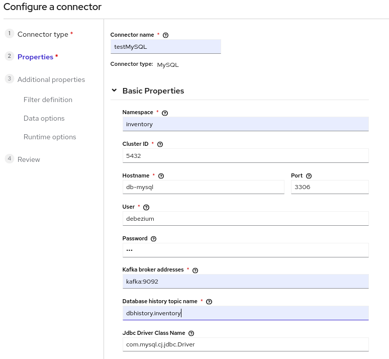
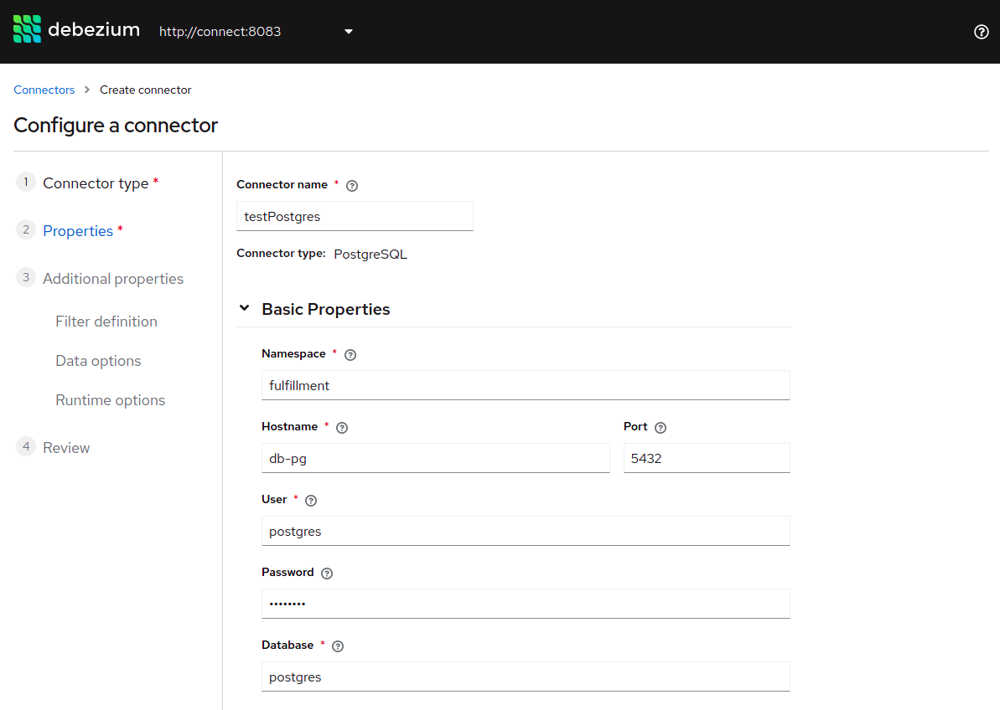
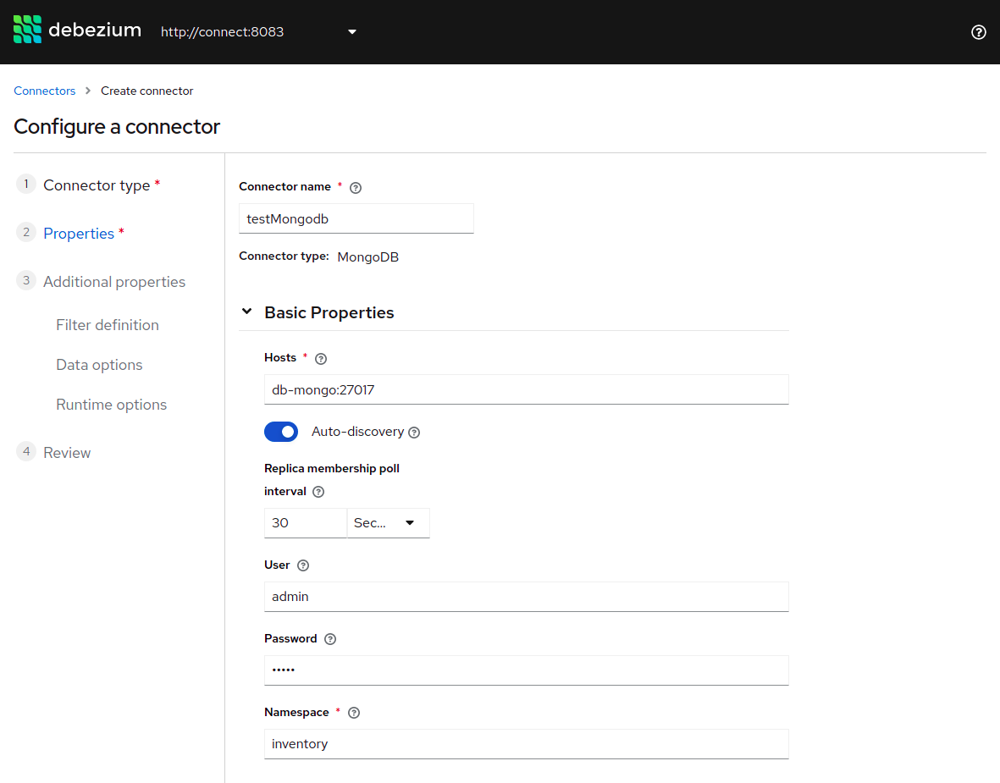

# Debezium UI Example

This demo automatically deploys the topology of services as defined in the [Debezium Tutorial](../tutorial) along with Debezium UI.  You can use the Debezium UI to view available connectors and create new connectors.


## Prerequisites

The Debezium UI is only available with Debezium version 1.5 and above.


## Launching UI

Launch all the required components for the topology as defined in [tutorial example](../tutorial)

```shell
export DEBEZIUM_VERSION=1.9
docker-compose up -d

Creating db-mysql  ... done
Creating db-pg     ... done
Creating zookeeper ... done
Creating db-mongo  ... done
Creating ui-demo_mongo-initializer_1 ... done
Creating kafka     ... done
Creating connect   ... done
Creating debezium-ui   ... done

```


The Debezium UI will be available on http://localhost:8080

## Create connectors via UI

You can create Postgres, Mongo DB, MySQL & SQL Server (coming soon) connectors using the Debezium UI.  Create the connectors using the *Create connector* wizard in the Debezium UI.  The first two steps of the wizard are mandatory (i.e. selecting the "Connector type" in step 1, then entering the basic connection "Properties" in step 2).  Additional steps in the wizard allow you to configure a variety of optional properties for each connector type.

For this demo, see the connection properties you can use for each connector type as illustrated below:
### MySQL
**Namespace**: inventory  
**Hostname**: db-mysql  
**User**: debezium  
**Password**: dbz  
**Kafka broker addresses**: kafka:9092  
**Database history topic name**: dbhistory.inventory  



### PostgreSQL
**Namespace**: fulfillment  
**Hostname**: db-pg  
**User**: postgres  
**Password**: postgres  
**Database**:postgres  



### MongoDB
**Hosts**: db-mongo:27017  
**User**: admin  
**Password**: admin  
**Namespace**: inventory  



## Command line clients
After the connectors are registered and running, you can interact via cli to query and make changes to the dbs

### MySQL
To connect with MySQL via cli:
```shell
docker exec -it db-mysql bash -c 'mysql -u $MYSQL_USER -p$MYSQL_PASSWORD inventory'

```

### PostgreSQL
To connect with PostgreSQL via cli:
```shell
docker exec -it db-pg bash -c 'psql -U $POSTGRES_USER $POSTGRES_PASSWORD'

```

### MongoDB
To connect with MongoDB via cli:
```shell
mongo -u admin -p admin --authenticationDatabase admin localhost:37017/inventory

```


## Examine the change events
You can examine change events which occur due to database changes

```shell
# Open in a new terminal
# Viewing the change events in the kafka container
docker exec -it kafka bash

./bin/kafka-console-consumer.sh --bootstrap-server kafka:9092 --topic [TOPIC_NAME] --from-beginning

```

## Stopping All Services
When finished with the demo, stop all of the services.

```console
$ docker-compose down
```

